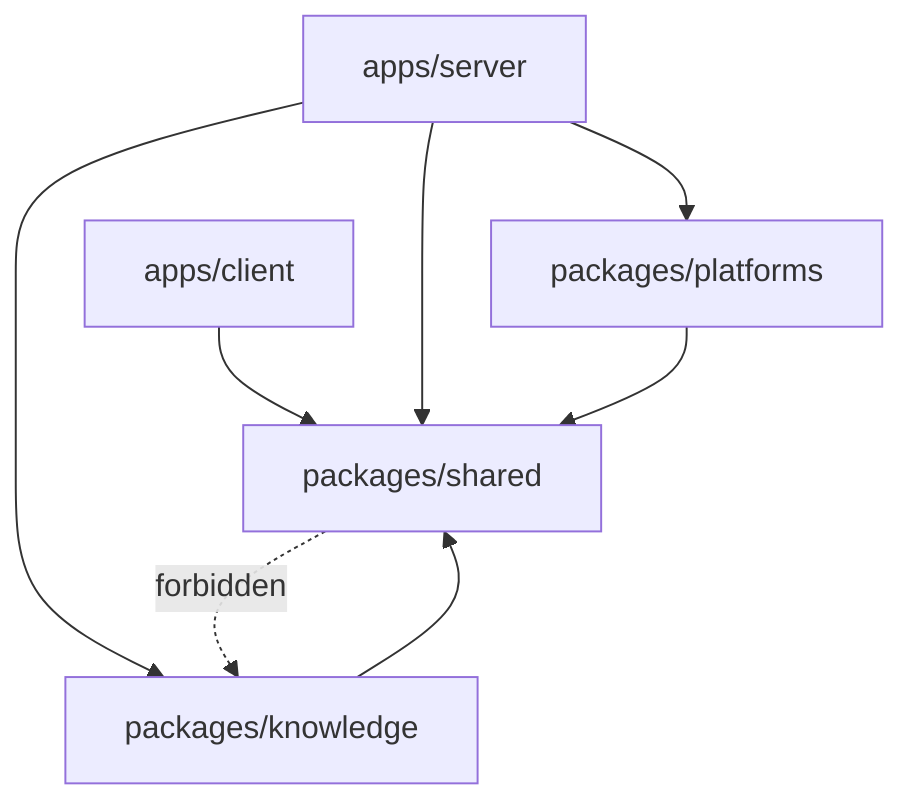
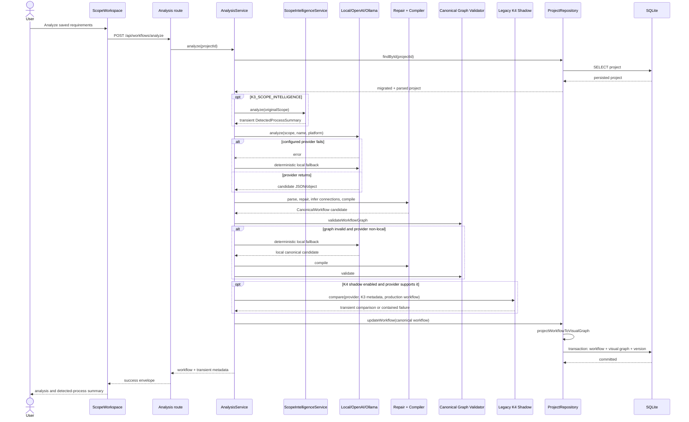
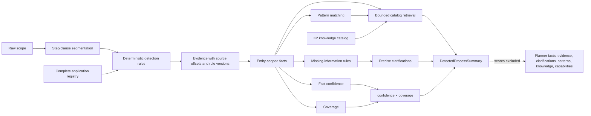
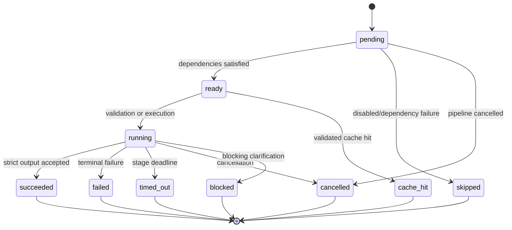
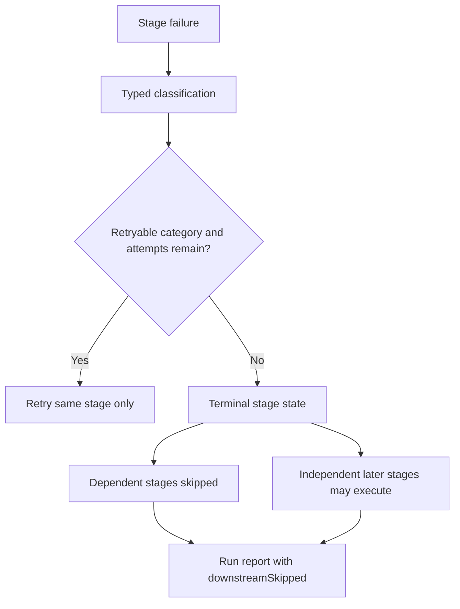
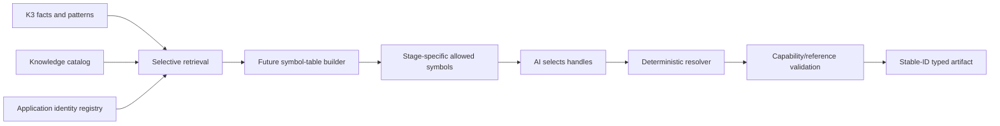
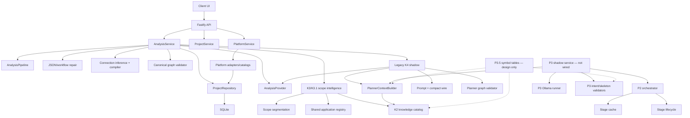

# Workflow Intelligence Planner
## K1–P3.5 Architecture Freeze and Principal Architect Audit

**Status:** Architecture freeze  
**Scope:** Current production workflow generation, K1–K3.1 deterministic
intelligence, the legacy K4 shadow planner, P1/P2 distributed-planner
foundation, P3 Stage A/B experiment, and the approved P3.5 controlled
vocabulary design  
**Implementation status:** No application code changed by this audit  
**Promotion status:** P3 is shadow-only; P4, Stage C, Stage D, K5, and
workflow-set persistence have not started

---

## 1. Executive architecture summary

The system currently contains three distinct planning lanes:

1. **Production workflow generation** calls the configured analysis provider,
   repairs and validates its canonical workflow, falls back to the
   deterministic local provider when necessary, and persists only the accepted
   canonical workflow and visual projection.
2. **K3/K3.1 deterministic intelligence** segments the scope, detects facts and
   evidence, calculates explainability metrics, retrieves bounded knowledge,
   and returns a detected-process summary as response metadata. It does not
   instruct production generation and is not persisted.
3. **Planner experiments** contain:
   - the older monolithic K4 grounded execution-graph shadow comparison, which
     is wired into analysis when enabled;
   - the P2 typed orchestrator and P3 Stage A/B experiment, which are implemented
     but not wired into application startup or a production request path.

P3.5 proposes a fourth architectural concern—a deterministic symbol-table
boundary—but it is a design only. No symbol table exists in runtime code.

The strongest architectural decision is the canonical workflow as the single
persisted source of truth. Planning facts, detected-process summaries, planner
contexts, shadow plans, distributed artifacts, scores, and future symbol tables
remain transient analysis or experiment artifacts.

The most important current weakness is duplicated planner architecture:

- K4 performs context construction, prompting, retries, parsing, reference
  validation, graph validation, and comparison in one service.
- P2/P3 provide a more disciplined stage orchestrator but are not integrated.
- The same concepts have overlapping P2, P3, K4.1, and compact-wire contracts.

Before P4, the project should consolidate these lanes and prove controlled
references in Stage A/B. It should not add another planner framework.

---

## 2. Architectural layers and components

| Layer | Components | Responsibility |
|---|---|---|
| Client | `App`, `ScopeWorkspace`, `DetectedProcessSummary`, workflow editor, business/automation/implementation views, comparison/export | Capture scope, invoke APIs, display analysis metadata, edit and render the canonical workflow |
| API | Fastify routes for projects, documents, analysis, platforms, assistant, health | Validate requests, invoke services, return response envelopes |
| Production analysis | `AnalysisService`, `AnalysisPipeline`, provider implementations, JSON repair, workflow repair, architecture compiler, graph validator | Produce, repair, validate, and persist the production canonical workflow |
| Deterministic intelligence | `segmentScope`, `ScopeIntelligenceService`, evidence scoring, coverage and reliability calculation | Produce explainable facts, patterns, clarifications, and bounded retrieval metadata |
| Knowledge | canonical-function registry, application packs, workflow patterns, rule manuals, platform capabilities | Define what concepts and operations are known and supported |
| Legacy grounded shadow | `PlannerContextBuilder`, `PlannerPromptBuilder`, compact wire format, `PlannerShadowService`, `validatePlannerGraph` | Generate and compare a complete grounded execution plan without replacing production |
| Distributed foundation | P2 contracts, `DistributedPlannerOrchestrator`, lifecycle rules, stage cache | Execute typed dependency stages with validation, retry, timeout, cancellation, provenance, and cache controls |
| P3 experiment | Stage A/B contracts, Ollama stage runner, P3 validators, `P3ShadowExperimentService` | Evaluate bounded intent interpretation and skeleton generation |
| Platform mapping | application registry, platform catalogs, platform adapters and validators | Convert the canonical workflow into Zapier, Make, or n8n implementation guidance |
| Persistence | SQLite database, `ProjectRepository`, project versions | Store projects, canonical workflows, visual projections, and version snapshots |
| Shared contracts | Zod schemas in `packages/shared` | Define platform-neutral API, workflow, intelligence, planner, and orchestration boundaries |

### Package dependency direction



The required dependency rule remains intact: `packages/knowledge` may depend on
`packages/shared`; `packages/shared` must not import `packages/knowledge`.

---

## 3. Complete request lifecycle

### 3.1 Project and scope lifecycle

1. The client creates a project through the projects API.
2. `ProjectRepository.create` writes:
   - an empty canonical workflow;
   - an empty visual graph;
   - project status `draft`;
   - version 1 with event `project_created`.
3. The user enters requirements or uploads a document.
4. Document extraction returns text but does not itself create a workflow.
5. Saving scope updates `original_scope` and creates a `scope_updated` version.

### 3.2 Production analysis lifecycle

1. Client calls `POST /api/workflows/analyze` with a project UUID.
2. The API parses `analyzeWorkflowRequestSchema`.
3. `AnalysisPipeline` emits a best-effort `preparing` progress event.
4. `AnalysisService` loads the project and rejects missing projects or scopes.
5. If K3 is enabled, deterministic scope intelligence runs synchronously:
   - segmentation;
   - fact and evidence detection;
   - pattern matching;
   - clarification detection;
   - bounded knowledge retrieval;
   - confidence, coverage, and reliability calculations.
6. The configured production provider runs:
   - `local`: deterministic extraction;
   - `ollama`: queued model call, trying configured installed models;
   - `openai`: Responses API call.
7. Provider failures fall back to `LocalAnalysisProvider`.
8. String output is parsed with JSON repair.
9. The candidate is checked against `aiWorkflowOutputSchema`.
10. A deterministic workflow-repair pass attempts safe structural repairs.
11. Invalid provider output falls back to the local provider.
12. Accepted output is passed through:
    - inferred workflow connections;
    - architecture compilation;
    - canonical graph validation.
13. Invalid non-local graphs fall back to local generation.
14. If K3 exists, the provider supports grounded planning, and K4 shadow is
    enabled, the legacy K4 shadow comparison runs.
15. Only the accepted production canonical workflow is persisted.
16. The repository deterministically creates a visual graph projection and a
    `workflow_analyzed` version snapshot.
17. The response can include transient `detectedProcess` and `plannerShadow`
    metadata.
18. The pipeline emits `complete` or `failed`. Reporter failures are ignored.

### 3.3 Editor and platform lifecycle

1. The client opens the editor using the persisted canonical workflow and
   visual graph.
2. Business, automation, and implementation views read the same workflow.
3. Editor changes update the canonical workflow plus visual graph and create a
   `graph_edited` version.
4. Platform conversion reads the persisted canonical workflow.
5. A selected adapter produces Zapier, Make, or n8n build guidance.
6. Platform validation adds implementation warnings but does not mutate the
   canonical workflow.

---

## 4. Complete production sequence diagram



---

## 5. Deterministic intelligence data flow



Confidence, coverage, and reliability are explainability and QA metrics. They
are returned in the detected-process summary but deliberately excluded from
planner context and prompts.

---

## 6. Contracts

### 6.1 Production and API contracts

| Contract | Purpose |
|---|---|
| `platformSchema` | Zapier, Make, or n8n |
| `projectStatusSchema` | Draft, analyzing, ready, needs input, archived |
| `canonicalWorkflowSchema` / `aiWorkflowOutputSchema` | Single persisted workflow source of truth |
| `workflowNodeSchema` | Canonical node including configuration and implementation metadata |
| `workflowConnectionSchema` | Canonical directed connection and mappings |
| `workflowBranchSchema` | Branch metadata |
| `errorHandlingRuleSchema` | Workflow error-handling policy |
| `clarificationQuestionSchema` | Persistable workflow clarification |
| `visualGraphSchema` | Renderer coordinates projected from canonical IDs |
| `projectSchema` | Project aggregate |
| `createProjectSchema` | Project creation input |
| `updateProjectScopeSchema` | Scope update input |
| `saveWorkflowEditorSchema` | Canonical workflow plus visual projection |
| `analyzeWorkflowRequestSchema` | Analysis command |
| `workflowAnalysisResultSchema` | Production workflow plus optional transient intelligence/shadow data |
| `extractedDocumentSchema` | Uploaded-document extraction result |
| `convertWorkflowRequestSchema` | Platform conversion command |

### 6.2 K1 planning and observability contracts

| Contract | Purpose | Runtime status |
|---|---|---|
| `planningFactsSchema` | Applications, entities, decisions, rules, clarifications, evidence | Additive contract; superseded in active K3 path by detected-process facts |
| `knowledgeContextSchema` | Retrieved references, allowed capabilities, hard rules | Additive contract; active planner uses its own `PlannerContext` projection |
| `analysisProgressEventSchema` | Ordered analysis progress events | Pipeline emits preparing/complete only; UI uses estimated local progress |
| `workflowSetPreviewSchema` | Non-persisted collection of canonical workflows | Contract only; no repository or production lifecycle |

### 6.3 K3/K3.1 contracts

| Contract | Purpose |
|---|---|
| `scopeSegmentSchema` | Step/clause with exact scope offsets |
| `deterministicEvidenceSchema` | Evidence type, relationship, confidence, weight, rule identity, source, explanation, traceability |
| `confidenceCalculationSchema` | Reproducible weighted confidence calculation |
| `detectedProcessFactSchema` | Entity-scoped detected fact with evidence |
| `processClarificationSchema` | Missing fact distinguished from an assumption |
| `coverageResultSchema` | Completeness across required dimensions |
| `workflowReliabilitySchema` | Product metric `confidence * coverage` |
| `detectedProcessSummarySchema` | Transient K3 intelligence result and retrieval summary |

### 6.4 K4.1/K4.2 legacy grounded-shadow contracts

| Contract | Purpose |
|---|---|
| `plannerEvidenceSchema` | Compact evidence projection |
| `plannerFactSchema` | Planner-safe fact projection |
| `plannerClarificationSchema` | Planner-safe clarification projection |
| `plannerKnowledgeEntrySchema` | Application/manual/operation/pattern/capability projection |
| `plannerContextSchema` | Complete grounded planner input without observability scores |
| `plannerNodeSchema` | Fully grounded execution node |
| `plannerEdgeSchema` | Explicit edge with reason, rule, and evidence |
| `structuredWorkflowPlanSchema` | K4.1 execution graph: nodes, edges, decisions, routers, merges, loops, retries |
| `compactPlannerPlanSchema` | Token-reduced AI wire representation |
| `plannerShadowComparisonSchema` | Shadow result, differences, metrics, diagnostics, failure |

### 6.5 P2 distributed planner contracts

| Contract | Purpose |
|---|---|
| `distributedPlannerStageIdSchema` | Intent, skeleton, node grounding, edge grounding, assembly, validation |
| `distributedPlannerStageStateSchema` | Pending through terminal lifecycle states |
| `distributedPlannerFailureCategorySchema` | Typed stage failure taxonomy |
| `plannerArtifactProvenanceSchema` | Run, stage, versions, model, scope/catalog/detector identity, upstream artifacts |
| `businessIntentInput/OutputSchema` | Generic Stage A boundary |
| `workflowSkeletonInput/OutputSchema` | Generic Stage B boundary |
| `nodeGroundingInput/OutputSchema` | Future Stage C boundary |
| `edgeGroundingInput/OutputSchema` | Future Stage D boundary |
| `deterministicAssemblyInput/OutputSchema` | Future software assembly boundary |
| `deterministicValidationInput/OutputSchema` | Future final validation boundary |
| `distributedPlannerFailureSchema` | Auditable failure artifact |
| `stageTransitionSchema` | Lifecycle event |
| `stageExecutionReportSchema` | Per-stage execution report |
| `distributedPlannerRunReportSchema` | Non-persisted run summary and optional final graph |

### 6.6 P3 strict Stage A/B contracts

| Contract | Purpose |
|---|---|
| `p3BusinessIntentInputSchema` | Raw scope, platform, deterministic facts, evidence, clarifications, patterns |
| `p3BusinessIntentOutputSchema` | Objective, actors, systems, entities, rules, questions, boundaries, references |
| `p3WorkflowSkeletonInputSchema` | Validated intent plus allowed functions and topology constraints |
| `p3WorkflowSkeletonOutputSchema` | Workflow previews with canonical placeholders, edges, conditions, routers, loops, merges, clarifications |

P2 uses contract version `2.0.0`; the P3 Stage A/B schema layer uses `3.0.0`.

### 6.7 P3.5 controlled-vocabulary contract

P3.5 is not implemented. Its frozen design is:

- stable registry string IDs remain authoritative;
- a per-run, namespace-scoped numeric symbol table becomes the AI wire format;
- symbol-table schema version, catalog version, and snapshot hash identify the
  vocabulary;
- software resolves symbols and generates workflow/node/edge identifiers;
- model output may select symbols but may not create identifiers;
- numeric handles are never persisted as canonical identity.

---

## 7. Registries and catalogs

| Registry/catalog | Ownership | Contents |
|---|---|---|
| Shared application registry | `packages/shared` | Broad application identity, aliases, categories, icons |
| Canonical-function registry | `packages/knowledge` | 20 workflow functions, semantic rules, cardinality and compatibility |
| Application operation packs | `packages/knowledge` | Asana, Google Drive, Google Sheets, Gmail, Slack, Generic API, Generic CRM |
| Workflow pattern registry | `packages/knowledge` | Six deterministic patterns |
| Rule manuals | `packages/knowledge` | Iterator, binary condition, multi-route, clarification guidance |
| Platform capabilities | `packages/knowledge` | Canonical function support/limitation/alternative per platform |
| Platform node catalogs | `packages/platforms` | Zapier, Make, and n8n renderer/build-plan definitions |
| Platform adapter registry | `packages/platforms` | Adapter selection and conversion |

### Canonical functions

Trigger, Action, Data Retrieval, Data Transformation, Validation, Filter,
Binary Condition, Multi-Route Decision, Iterator, Loop, Merge, Aggregator,
Delay, Human Approval, Retry, Error Handler, Notification, Logging, Manual
Review, and End.

### Current registry duplication

The shared application registry, knowledge application packs, and platform
adapter `serviceEvents` all describe applications or operations. They serve
different layers, but identity and alias data overlap. The knowledge catalog
should become the authoritative capability source while the shared registry
remains a lightweight platform-neutral identity registry.

---

## 8. Validators

| Validator | Boundary enforced |
|---|---|
| Zod API schemas | External request and response shape |
| `aiWorkflowOutputSchema` | Provider output shape |
| Workflow repair validation | Safe deterministic normalization before acceptance |
| `validateWorkflowGraph` | Production canonical graph integrity |
| Knowledge catalog integrity tests | Unique IDs, valid function references, cardinality and limitation consistency |
| K3 schemas and acceptance rules | Evidence traceability, rule versions, scoring reproducibility, entity cardinality |
| `validatePlannerGraph` | K4.1 graph references, topology, clarifications, allowed operations/capabilities |
| Compact wire schema + expansion | AI wire shape to K4.1 graph |
| P2 stage input/output schemas | Every distributed stage boundary |
| Stage dependency/version checks | Missing dependency, version mismatch, circular graph |
| Lifecycle transition validator | Legal stage state transitions |
| Cache integrity validator | Key and content-hash consistency |
| `validateP3Intent` | Valid fact/knowledge references, clarification retention, no operations or metrics |
| `validateP3Skeleton` | Valid canonical functions, references, topology, clarifications, no operations or metrics |
| Platform adapter validation | Platform buildability warnings |
| Repository schemas and migration | Persisted aggregate validity |

Validation is layered correctly, but reference validation is implemented
separately in K4 and P3. A future controlled-reference resolver should be
shared by both stage validators and graph validators.

---

## 9. Caches

### 9.1 K4 planner-context cache

- Type: in-memory `Map`.
- Value: `PlannerContext`.
- Key:
  - SHA-256 scope hash;
  - knowledge catalog version;
  - K3 rule version;
  - K4 prompt version;
  - target platform.
- Lifetime: server process.
- Invalidation: version/key change or explicit `clear`.
- Does not cache model output.

### 9.2 P2/P3 stage cache

- Type: `StageCache` interface; current implementation is in-memory.
- Value: strict stage output plus hash, provenance, and creation time.
- Key includes:
  - normalized scope hash;
  - stage instance ID and semantic stage ID;
  - stage version;
  - detector and catalog versions;
  - input contract version;
  - platform;
  - upstream output hashes;
  - model identity;
  - full input hash.
- Integrity: cached output hash is recomputed before use.
- Corruption: stage fails closed with `cache-corruption`.
- Bypass: global run option or stage policy.
- Invalidation: exact key or full cache clear.
- Lifetime: `P3ShadowExperimentService` instance; currently not durable.

### Cache audit

The key design is strong and content-addressed. The implementation is
appropriate for experiments but not distributed execution: it has no TTL,
capacity bound, durable backend, cross-process coordination, or eviction
policy.

---

## 10. Feature flags

| Flag | Default | Wired into runtime? | Effect |
|---|---:|---|---|
| `K3_SCOPE_INTELLIGENCE` | `true` | Yes | Constructs or removes deterministic scope intelligence |
| `K4_PLANNER_SHADOW` | `true` | Yes | Runs legacy monolithic grounded planner comparison when the provider supports it |
| `P2_DISTRIBUTED_PLANNER` | `false` | **No** | Declared and tested only; server startup never reads it |
| `P3_DISTRIBUTED_PLANNER` | `false` | **No** | Declared and tested only; server startup never constructs P3 |
| `LIVE_K4_2` | unset | Test only | Opts into live K4 benchmark |
| `LIVE_P3` | unset | Test only | Opts into live P3 benchmark |

Calling P2/P3 “disabled by default” is operationally true, but incomplete:
they are currently unreachable from the application regardless of flag value.

---

## 11. Environment variables and defaults

| Variable | Default | Purpose |
|---|---:|---|
| `NODE_ENV` | `development` | Runtime mode |
| `HOST` | `127.0.0.1` | Server bind address |
| `PORT` | `4000` | Server port |
| `DATABASE_PATH` | `./data/automation-workflow-mapper.db` | SQLite path |
| `CLIENT_ORIGIN` | `http://localhost:5173` | CORS origin |
| `LOG_LEVEL` | `info` | Fastify logging |
| `AI_PROVIDER` | `local` | Production analysis provider |
| `OPENAI_API_KEY` | none | Required for OpenAI |
| `OPENAI_BASE_URL` | `https://api.openai.com/v1` | OpenAI-compatible endpoint |
| `OPENAI_MODEL` | `gpt-5.6-luna` | Configured OpenAI model name |
| `OLLAMA_BASE_URL` | `http://127.0.0.1:11434` | Ollama endpoint |
| `OLLAMA_MODELS` | `qwen3:8b,llama3.2:3b` | Ordered production Ollama fallback models |
| `K3_SCOPE_INTELLIGENCE` | `true` | Deterministic analysis flag |
| `K3_KNOWLEDGE_BUDGET` | `12000` | Maximum retrieved knowledge characters |
| `K4_PLANNER_SHADOW` | `true` | Legacy shadow flag |
| `K4_PLANNER_TIMEOUT_MS` | `180000` | K4 generation deadline |
| `K4_PLANNER_MAX_OUTPUT_CHARS` | `120000` | K4 output bound |
| `K4_PLANNER_MAX_RETRIES` | `1` | K4 corrective retries |
| `K4_PLANNER_CONTEXT_BUDGET` | `24000` | K4 prompt/context budget |
| `P2_DISTRIBUTED_PLANNER` | `false` | Declared distributed planner flag |
| `P2_DISTRIBUTED_PLANNER_TOTAL_TIMEOUT_MS` | `300000` | P2 total deadline |
| `P2_DISTRIBUTED_PLANNER_STAGE_TIMEOUT_MS` | `60000` | P2 default stage deadline |
| `P2_DISTRIBUTED_PLANNER_MAX_RETRIES` | `1` | P2 retry ceiling |
| `P2_DISTRIBUTED_PLANNER_CONCURRENCY` | `2` | Declared concurrency limit |
| `P2_DISTRIBUTED_PLANNER_CACHE` | `true` | Stage-cache setting |
| `P3_DISTRIBUTED_PLANNER` | `false` | Declared P3 experiment flag |
| `P3_STAGE_A_TIMEOUT_MS` | `180000` | Stage A deadline |
| `P3_STAGE_B_TIMEOUT_MS` | `240000` | Stage B deadline |
| `P3_TOTAL_TIMEOUT_MS` | `480000` | P3 total deadline |
| `P3_STAGE_MAX_RETRIES` | `1` | Per-stage corrective retries |
| `P3_STAGE_MAX_OUTPUT_CHARS` | `60000` | Stage output bound |
| `P3_CACHE_ENABLED` | `true` | P3 stage-cache setting |

The P3 service currently hard-codes model `qwen3:8b` and reads
`OLLAMA_BASE_URL` directly instead of receiving the configured provider/model
through dependency injection.

---

## 12. Planner artifacts

| Artifact | Produced by | Persisted? |
|---|---|---:|
| Canonical workflow | Production provider + deterministic compiler | **Yes** |
| Visual graph projection | Repository projection | **Yes** |
| Project version snapshot | Repository transaction | **Yes** |
| Analysis progress event | `AnalysisPipeline` | No |
| Scope segments | K3.1 | No |
| Deterministic evidence | K3/K3.1 | No |
| Detected facts and clarifications | K3/K3.1 | No |
| Confidence, coverage, reliability | K3/K3.1 | No |
| Retrieved knowledge summary | K3/K3.1 | No |
| Planner context | K4 context builder | No |
| K4 grounded execution graph | K4 shadow planner | No |
| K4 comparison and metrics | K4 shadow service | Response only |
| Stage A business intent | P3 | No |
| Stage B workflow skeleton | P3 | No |
| Stage execution reports | P2/P3 | No |
| Artifact provenance | P2/P3 | No |
| Stage cache entries | P2/P3 in-memory cache | No durable persistence |
| Workflow set preview | Contract only | No |
| Symbol-table snapshot | P3.5 design only | Not implemented |

---

## 13. Deterministic, AI, persistence, and rollback boundaries

### Deterministic boundaries

- API and environment schema parsing
- Scope segmentation and K3 rule evaluation
- Evidence scoring and source traceability
- Knowledge selection and budgets
- Application alias resolution
- Provider-output parsing/repair
- Workflow connection inference and compilation
- Canonical graph validation
- Planner-context construction
- Reference and topology validation
- P2 dependency ordering and lifecycle
- Cache keys, hashes, and provenance
- Platform conversion and validation
- Visual graph projection
- Repository transactions and version creation

### AI boundaries

- Production OpenAI/Ollama workflow generation
- Legacy K4 grounded plan generation
- P3 Stage A intent interpretation
- P3 Stage B skeleton generation

AI output is never trusted directly. Each active or experimental boundary is
followed by schema parsing and deterministic acceptance.

### Persistence boundary

Only `ProjectRepository` writes workflow state. The accepted production
`CanonicalWorkflow` and its `VisualGraphProjection` cross this boundary.
Detected-process metadata, K4 plans, P2/P3 artifacts, and scores do not.

### Rollback boundaries

| Capability | Immediate rollback |
|---|---|
| K3 deterministic metadata | Set `K3_SCOPE_INTELLIGENCE=false` |
| K4 legacy shadow | Set `K4_PLANNER_SHADOW=false` |
| P2/P3 experiments | No runtime action needed; they are not wired |
| Knowledge changes | Revert catalog package/version |
| Provider change | Change `AI_PROVIDER`; production retains local fallback |
| Workflow edit | Use project version snapshot manually; no version-restore API exists |
| Database schema | Back up/restore SQLite; migrations are currently inline and minimal |
| P3.5 future symbols | Disable future flag; numeric symbols must never require data migration |

---

## 14. P2/P3 distributed execution lifecycle



### Execution timeline

| Time | Activity |
|---|---|
| T0 | Resolve dependency order and reject missing/circular/incompatible stages |
| T1 | Create run ID, total abort controller, reports, and transient output maps |
| T2 | For each stage, check total cancellation, enablement, and dependencies |
| T3 | Build and parse strict stage input |
| T4 | Freeze input and calculate content/cache hashes |
| T5 | Resolve and validate cache entry or record miss/bypass |
| T6 | Run attempt under stage and total deadlines |
| T7 | Parse strict stage output and check blockers |
| T8 | Retry only if category and policy permit |
| T9 | Hash output, record provenance, optionally cache it |
| T10 | Skip downstream dependencies after terminal failure |
| T11 | Return non-persisted run report |

Despite `maximumConcurrency`, the current implementation uses a sequential
`for` loop. Parallel groups and the concurrency setting are contracts only.

---

## 15. Failure and retry propagation

### Failure propagation



### Failure taxonomy

- Invalid input
- Invalid output
- Dependency failure
- Timeout
- Cancellation
- Provider unavailable
- Provider connection failure
- Malformed model output
- Unsupported capability
- Blocking clarification
- Cache corruption
- Orchestration error
- Unknown

### Retry rules

- Retries are stage-local.
- P3 retries malformed output and invalid output only.
- P3 permits one retry by default.
- Stage A failure prevents Stage B.
- Stage B retry reuses validated Stage A.
- Timeout is separately classified and not retried indefinitely.
- Blocking clarification is not a retry reason.
- Cache corruption fails closed.
- Production analysis has a different fallback mechanism: switch to the
  deterministic local provider rather than stage retry.

### Audit concern

The P2 total-timeout abort is normalized as cancellation inside
`runBounded` when the total signal aborts, although later normalization can
classify the run-level condition as timeout. Timeout provenance should have one
unambiguous owner before promotion.

---

## 16. Shadow-mode flow

### Legacy K4 shadow

The K4 shadow service is part of the production request lifecycle when enabled:

1. Production workflow is generated and validated first.
2. K3 metadata is projected into `PlannerContext`.
3. Context is cached.
4. A compact prompt and constrained schema are built.
5. The same configured provider generates a full grounded graph.
6. The output is parsed, expanded, reference-checked, and graph-validated.
7. Failures are returned as a shadow result rather than thrown.
8. The comparison is included in the API response but not persisted.
9. Production workflow persistence is independent of shadow success.

This preserves correctness but adds synchronous latency to the user request.

### P3 shadow

P3 currently runs only through tests or direct service invocation:

1. Build planner context from K3 metadata.
2. Stage A receives scope, facts, evidence, clarifications, and patterns.
3. Stage A output is schema- and reference-validated.
4. Stage B receives only validated Stage A and bounded deterministic context.
5. Stage B output is schema-, reference-, and topology-validated.
6. The service compares a serialized production snapshot before/after.
7. The result always declares `persisted: false`.

No application route or startup wiring invokes this service.

---

## 17. Production versus shadow flow

| Concern | Production | K4 shadow | P3 shadow |
|---|---|---|---|
| Output | Canonical workflow | Full grounded execution graph | Intent + skeleton |
| Trigger | Analysis API | Same analysis request when enabled | Tests/direct invocation only |
| Provider | Configured provider with local fallback | Configured provider if grounded planning supported | Hard-coded Ollama Qwen 3 8B |
| Validation | Schema + repair + graph | Schema + references + graph | Per-stage schema + references + topology |
| Failure effect | Fallback or request failure | Contained comparison failure | Contained experiment failure |
| Persistence | Workflow + visual graph | None | None |
| User-visible | Primary result | Optional response metadata | Not wired |
| Default | Active | Enabled by default | Unreachable/declared false |

---

## 18. Future Stage C integration point

Stage C should consume:

- one validated Stage B node placeholder at a time;
- predecessor and successor context;
- controlled application, operation, canonical-function, fact, pattern,
  knowledge, capability, and clarification symbols;
- explicit platform context.

Stage C should return only a grounded node artifact. It should not modify
topology, invent operations, or generate final IDs. Independent nodes may be
parallelized only after the orchestrator truly supports bounded concurrency.

Software should:

1. resolve symbol selections;
2. validate capability support and cardinality;
3. generate stable node IDs;
4. retain limitations and alternatives;
5. cache each node artifact independently.

P4 should not start until Stage A/B pass controlled-vocabulary acceptance.

---

## 19. Future Stage D integration point

Stage D should consume:

- a validated skeleton edge;
- resolved source and target Stage C nodes;
- controlled decision/rule/evidence symbols;
- required condition semantics.

It should return:

- source and target references;
- explicit handle/route semantics;
- condition and label;
- purpose and business reason;
- rule and evidence selections.

Software must validate binary TRUE/FALSE ownership, router destinations, loop
back/exit edges, merge inputs, and retry boundaries before deterministic
assembly.

---

## 20. Future Workflow Set integration point

The existing `workflowSetPreviewSchema` is a non-persisted preview contract.
Future workflow sets should be isolated behind:

```text
Project
  └─ WorkflowSet
       ├─ Workflow A
       ├─ Workflow B
       └─ Shared project context
```

Required future decisions:

- workflow identity and ordering;
- cross-workflow references;
- shared versus workflow-specific clarifications;
- platform conversion per workflow;
- editor routing and versioning;
- migration of the current single `workflow_json`;
- atomic save semantics.

No workflow-set persistence should be introduced as part of Stage C/D.
Workflow sets deserve a separate migration sprint after planner quality is
stable.

---

## 21. Future multi-model integration point

The P2 `ModelNeutralStageRunner` is the correct seam. A future model router
should select a runner per stage using:

- stage capability requirements;
- model availability;
- context/output limits;
- measured acceptance performance;
- privacy/cost policy;
- deterministic model identity in cache keys.

Multi-model support must not allow automatic semantic fallback that changes
business meaning. A fallback model reruns the same typed input and must pass the
same validator. Model identity and prompt/contract version belong in
provenance.

The current P3 service bypasses this seam operationally by constructing an
Ollama runner with hard-coded `qwen3:8b`. That should be corrected before
multi-model experiments.

---

## 22. Catalog and symbol-table interaction



The symbol table must be a projection of retrieved authoritative registries,
not a new registry. Stable IDs stay in catalogs; integer handles are ephemeral
wire values scoped by namespace and snapshot hash.

If retrieval omits a required capability, the planner must return unresolved
grounding. It must not select a nearest symbol or invent a replacement.

---

## 23. Renderer interaction

The renderer must remain downstream of accepted canonical state:

1. `CanonicalWorkflow` is the domain source of truth.
2. `VisualGraphProjection` stores layout IDs and coordinates only.
3. Editor store synchronizes node and connection edits back to the canonical
   workflow.
4. Business flow and implementation notes are projections from the same nodes.
5. Platform adapters produce build guidance from the canonical workflow.
6. Export renders the editor/canonical graph; planner artifacts should never be
   rendered as if they were accepted production workflows.

Future distributed artifacts require an explicit preview renderer boundary.
Stage B skeletons may be previewed, but the UI must label them as ungrounded,
non-persisted drafts. Stage C/D artifacts must pass assembly and deterministic
validation before entering the existing workflow renderer.

---

## 24. Complete dependency graph



No circular package dependency exists. The runtime architecture does contain
conceptual duplication between K4 and P2/P3, but not a dependency cycle.

---

## 25. Architecture evolution from K1 to P3.5

| Milestone | Architectural contribution |
|---|---|
| K1 | Additive planning, retrieval, progress, repair-report, and workflow-set preview contracts |
| K2 | Typed versioned canonical knowledge catalog and operation packs |
| K3 | Deterministic evidence, facts, patterns, clarifications, bounded retrieval, explainability UI |
| K3.1 | Segmentation, entity-scoped cardinality, expanded workflow-function detection, coverage/reliability separation |
| K4 | Grounded planner context and shadow prompt integration |
| K4.1 | Explicit execution-graph representation |
| K4.2 | Compact wire/runtime reliability experiments |
| P1 | Distributed planner architecture direction |
| P2 | Typed orchestrator, stage contracts, lifecycle, failure taxonomy, retry, cache, provenance |
| P3 | Live Stage A intent and Stage B skeleton experiment |
| P3.5 | Controlled vocabulary/symbol-table architecture design |

---

## 26. Principal architect redesign before P4

If joining today, I would require the following before allowing P4:

### 26.1 Consolidate planner lanes

Declare P2/P3 the only future planner runtime. Freeze K4 as a benchmark adapter,
then extract reusable context, provider, validation, and wire-format pieces.
Do not maintain two production-capable orchestration systems.

### 26.2 Implement controlled references in Stage A/B

The next experiment should use:

- closed, stage-specific symbol tables;
- software-generated structural IDs;
- stable clarification handles;
- canonical vocabulary aligned directly with the K2 registry;
- no model-generated fact, knowledge, capability, or rule IDs.

### 26.3 Fix canonical vocabulary ownership

The P3 failure on `merge` shows that context selection, the canonical registry,
and skeleton validation can disagree. One function registry must generate:

- allowed symbols;
- prompt values;
- validator membership;
- platform capability lookups.

### 26.4 Wire nothing into production yet

P2/P3 flags should remain inert until acceptance succeeds. When wiring begins,
add an explicit experiment service composition root rather than constructing
runners inside domain services.

### 26.5 Correct orchestration claims

Either implement real bounded parallel scheduling or remove
`maximumConcurrency` and `parallelGroup` until needed. Contracts must describe
actual behavior.

### 26.6 Separate user latency from evaluation

Legacy K4 shadow currently runs synchronously inside production analysis. Move
evaluation to a bounded background/after-response mechanism before wider
benchmarking, while preserving local-only deployment constraints.

---

## 27. Technical debt

### High priority

- Duplicate K4 and P2/P3 planner runtimes.
- Free-form model-generated references.
- P2/P3 configuration is declared but not composed into the application.
- Concurrency configuration is not implemented.
- P3 hard-codes Qwen and reads process environment directly.
- Application/capability identity is distributed across three catalogs.
- K4 shadow adds synchronous latency to the production request.

### Medium priority

- K1 `PlanningFacts`/`KnowledgeContext` contracts overlap newer detected-process
  and planner-context models.
- P2 and P3 duplicate Stage A/B schemas with different versions.
- Reference validation is repeated across P3 and K4.
- Progress pipeline emits few real stages while the UI estimates percentages.
- SQLite migrations are embedded in startup code rather than versioned.
- Project versions exist without a restore/list API.
- In-memory caches are unbounded and process-local.
- The local deterministic provider mixes extraction heuristics with workflow
  construction and application inference.

### Lower priority

- Formatting in environment configuration is inconsistent.
- Some platform adapter mappings are heuristic and broader than verified K2
  capabilities.
- The client bundle has a large-chunk warning.

---

## 28. Unnecessary complexity

The primary unnecessary complexity is representational duplication:

- `PlanningFacts`
- `DetectedProcessSummary`
- `PlannerContext`
- P2 intent/skeleton contracts
- P3 intent/skeleton contracts
- K4 compact plan
- K4 structured plan
- Canonical workflow

These are not all wrong—each can be a valid stage artifact—but the boundaries
are not yet governed by a single artifact taxonomy. The project should define:

1. source intelligence artifacts;
2. planner stage artifacts;
3. final canonical domain artifact;
4. renderer projections.

Anything outside those four classes should be merged or removed.

The second unnecessary complexity is keeping both monolithic and distributed
planner retry/cache/validation machinery active indefinitely.

---

## 29. Excellent abstractions

- **Canonical workflow as the sole persisted source of truth**
- **Strict Zod contracts at every external and stage boundary**
- **`packages/knowledge → packages/shared` dependency direction**
- **Deterministic evidence with exact source traceability**
- **Confidence and coverage excluded from planner instructions**
- **Explicit clarification preservation**
- **Content-addressed cache keys with upstream hashes and versions**
- **Artifact provenance**
- **Typed failure taxonomy and lifecycle**
- **Model-neutral stage runner interface**
- **Platform adapters downstream of canonical state**
- **Synchronized layered UI views**
- **Fallback to deterministic local generation**
- **No persistence of experimental planner artifacts**

These should be preserved.

---

## 30. Abstractions to merge or split

### Merge

- Merge P2 and P3 Stage A/B contracts into one versioned contract family after
  controlled-vocabulary design is proven.
- Merge P3 and K4 reference checking behind a shared deterministic resolver.
- Merge operation/capability identity derivation into the knowledge layer.
- Merge planner cache/version identity rules into a shared planner runtime
  utility.
- Merge legacy K1 planning-fact concepts into the active K3 artifact model or
  formally mark them deprecated.

### Split

- Split provider transport from stage prompt/contract behavior.
- Split K4 benchmarking from the synchronous production request.
- Split local provider scope extraction from workflow construction.
- Split repository migration management from database bootstrap.
- Split renderer preview artifacts from accepted canonical-workflow rendering.
- Split application identity from capability/operation definitions while
  retaining one stable application ID namespace.

---

## 31. Scalability risks

- Large scopes create too many facts and references for a single Stage A call.
- Full vocabularies will exceed prompt budgets; symbol tables require selective
  retrieval.
- Ten thousand capabilities cannot be supplied globally.
- In-memory caches do not scale across processes and can grow without bounds.
- SQLite single-writer behavior will eventually limit concurrent users.
- Ollama provider calls are serialized through one queue, limiting throughput.
- Current orchestrator is sequential even for independent stages.
- Full graph schemas and verbose evidence can dominate context.
- Workflow-set persistence will require new indexing and atomic versioning.
- Rendering very large graphs will require viewport virtualization and
  incremental layout.

---

## 32. Maintenance risks

- Multiple contract versions without explicit deprecation policy.
- Registry disagreement causing false validation failures.
- Hard-coded model names and topology strings.
- Inline environment construction in tests becoming brittle.
- Heuristic platform mappings diverging from verified knowledge packs.
- Shadow features enabled by default despite high latency.
- Experiment-only flags creating the impression of runtime support.
- Reports and benchmark contracts becoming a parallel source of architectural
  truth.
- Lack of durable artifact observability if distributed planning is promoted.

---

## 33. Where to stop architecting and start shipping

Stop adding architecture after three narrowly bounded tasks:

1. controlled-vocabulary Stage A/B contracts and resolver;
2. one unified distributed-planner composition path in shadow mode;
3. acceptance proof that Stage A reaches at least 5/6 and Stage B reaches at
   least 4/6 on the frozen corpus with zero unsupported operations and zero
   invented blocking policy.

Then ship user-facing value before Stage C/D:

- a reliable detected-process summary;
- clearer clarification capture and resolution;
- stronger platform recommendations from the existing catalog;
- workflow version browsing/restoration;
- large-workflow renderer performance;
- dependable archive, navigation, and project management.

Stage C/D should begin only when users are benefiting from the deterministic
intelligence and the Stage A/B foundation is measurably reliable. More
orchestration abstractions before that point would be architecture without
validated product value.

---

## 34. Final architecture review

The project has a sound domain core and unusually strong safety instincts:
strict contracts, deterministic evidence, capability limitations, explicit
clarifications, versioned knowledge, canonical persistence, and shadow-only
experiments.

Its current risk is not insufficient architecture. It is an excess of adjacent
representations and planner paths accumulated while discovering the correct
boundaries.

The architecture freeze should therefore hold:

- no P4;
- no Stage C/D;
- no K5;
- no workflow-set migration;
- no new planner abstraction.

The next approved engineering work should reduce reference drift and
consolidate existing abstractions. After that, the project should return to
shipping visible workflow-analysis improvements.

