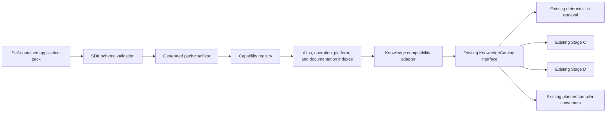
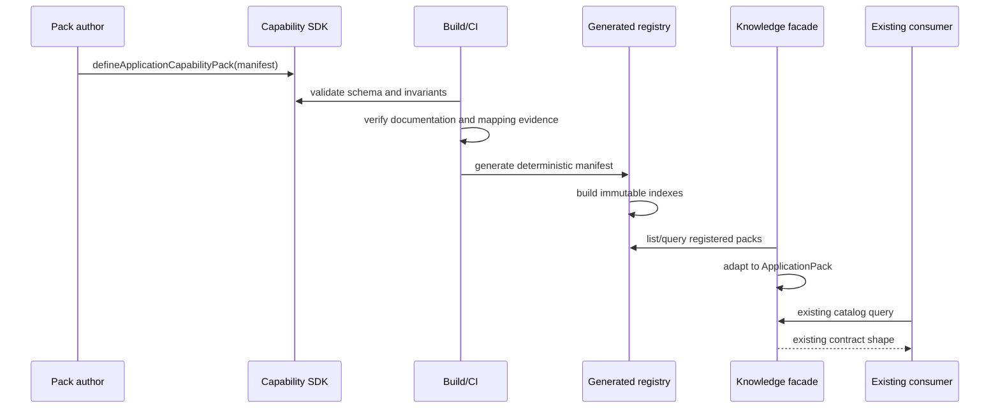

# Application Capability SDK — Architecture Design

**Status:** Design only  
**Architecture boundary:** Post-Version 1 extension mechanism  
**Implementation status:** Not started

## 1. Executive recommendation

Introduce a declarative `@awm/capability-sdk` and a generated `@awm/capability-registry`. Every application becomes a self-contained capability pack that declares identity, aliases, authentication, triggers, actions, searches, webhooks, limitations, documentation, and platform mappings.

The existing `@awm/knowledge` package remains the public compatibility facade used by scope intelligence, retrieval, planning, Stage C, and Stage D. It adapts registered SDK packs into the existing `ApplicationPack` and `OperationDefinition` shapes. No planner or compiler consumer changes are required.

The SDK must be declarative. Capability packs provide data, not arbitrary executable callbacks. Deterministic schemas, integrity checks, evidence provenance, and generated indexes make the catalog safe and scalable.

## 2. Responsibility boundaries

| Component | Owns | Must not own |
|---|---|---|
| `packages/shared` | Platform-neutral canonical workflow contracts and stable primitive types | Capability-pack discovery or knowledge imports |
| `packages/capability-sdk` | Pack schemas, TypeScript contracts, validators, builders, compatibility policy | Application data or planner behavior |
| `capability-packs/*` | One application's operations, limitations, documentation, and mappings | Registry orchestration, graph construction, prompts |
| `packages/capability-registry` | Validated composition, alias/operation indexes, generated manifest | Business planning or topology |
| `packages/knowledge` | Compatibility adapter, canonical functions, workflow patterns, retrieval facade | Monolithic hand-authored application catalog |
| `packages/platforms` | Generic platform adapter mechanics and platform-wide primitives | Application capability truth duplicated from packs |
| Planner / compiler / Stage C / Stage D | Consume the existing knowledge facade | Discover or import individual packs |

Hard dependency rule remains:

```text
packages/shared
      ↑
packages/capability-sdk
      ↑
capability-packs/*
      ↑
packages/capability-registry
      ↑
packages/knowledge
      ↑
existing consumers
```

`packages/shared` never imports the SDK, registry, packs, or knowledge package.

## 3. Runtime architecture



Adding a pack changes the generated registry inputs, not any planner, compiler, grounding, workflow-set, or persistence implementation.

### Registration lifecycle



## 4. SDK contracts

The following interfaces illustrate the proposed public SDK. Exact Zod syntax can be finalized during implementation, but field semantics should not be weakened.

```ts
export type CapabilityPackSchemaVersion = '1.0';
export type SupportLevel = 'native' | 'workaround' | 'unsupported' | 'unknown';
export type OperationKind = 'trigger' | 'action' | 'search' | 'webhook';
export type VerificationState = 'verified' | 'unverified' | 'deprecated';

export interface ApplicationCapabilityPack {
  schemaVersion: CapabilityPackSchemaVersion;
  packId: string;                 // e.g. "com.shopify"
  packVersion: string;            // SemVer
  catalogCompatibility: string;   // e.g. "^1.0.0"
  application: ApplicationIdentity;
  authentication: AuthenticationDefinition[];
  triggers: TriggerCapability[];
  actions: ActionCapability[];
  searches: SearchCapability[];
  webhooks: WebhookCapability[];
  limitations: ApplicationLimitation[];
  documentation: DocumentationBundle;
  platformMappings: PlatformMapping[];
  provenance: PackProvenance;
}

export interface ApplicationIdentity {
  id: string;                     // stable kebab-case ID
  name: string;
  aliases: string[];
  category: string;
  iconKey: string;
  website: string | null;
}

export interface CapabilityBase {
  id: string;                     // stable within the application
  kind: OperationKind;
  title: string;
  purpose: string;
  canonicalFunctionId: CanonicalFunctionId;
  inputs: CapabilityField[];
  outputs: CapabilityField[];
  acceptedInputCardinality: DataCardinality[];
  producedOutputCardinality: DataCardinality;
  batchSupport: BatchSupport;
  prerequisites: CapabilityPrerequisite[];
  limitations: CapabilityLimitationReference[];
  documentationRefs: string[];
  lifecycle: CapabilityLifecycle;
}

export interface TriggerCapability extends CapabilityBase {
  kind: 'trigger';
  delivery: 'instant' | 'polling' | 'scheduled' | 'unknown';
  deduplicationKey: string | null;
}

export interface ActionCapability extends CapabilityBase {
  kind: 'action';
  idempotency: 'native' | 'caller_required' | 'not_supported' | 'unknown';
  sideEffect: true;
}

export interface SearchCapability extends CapabilityBase {
  kind: 'search';
  resultMode: 'zero_or_one' | 'collection' | 'paginated_collection';
  pagination: PaginationDefinition | null;
}

export interface WebhookCapability extends CapabilityBase {
  kind: 'webhook';
  direction: 'inbound' | 'outbound';
  verification: 'signature' | 'token' | 'none' | 'unknown';
  eventType: string;
}

export interface CapabilityField {
  key: string;
  label: string;
  dataType: KnowledgeDataType;
  required: boolean;
  nullable: boolean;
  description: string;
  cardinality: DataCardinality;
  sensitive: boolean;
  example?: unknown;
}

export interface BatchSupport {
  supported: boolean;
  maximumItems: number | null;
  behavior: 'single_request' | 'platform_items' | 'iterator_required' | 'unknown';
}

export interface ApplicationLimitation {
  id: string;
  severity: 'info' | 'warning' | 'blocking';
  scope: 'application' | 'authentication' | 'operation' | 'platform';
  summary: string;
  detail: string;
  alternative: string | null;
  documentationRefs: string[];
}

export interface PlatformMapping {
  operationRef: string;           // "<applicationId>.<operationId>"
  platform: Platform;
  support: SupportLevel;
  connector: {
    app: string;
    component: string;
    eventOrOperation: string;
  } | null;
  credentialType: string | null;
  fieldMappings: PlatformFieldMapping[];
  limitationRefs: string[];
  alternative: PlatformAlternative | null;
  evidence: MappingEvidence;
}

export interface MappingEvidence {
  verification: VerificationState;
  sourceType: 'official_documentation' | 'connector_catalog' | 'manual_test';
  sourceUrl: string | null;
  verifiedAt: string | null;
  verifiedBy: string | null;
  connectorVersion: string | null;
}

export interface DocumentationBundle {
  overview: DocumentationEntry;
  authentication: DocumentationEntry[];
  operations: DocumentationEntry[];
  rateLimits: DocumentationEntry[];
  pagination: DocumentationEntry[];
  webhooks: DocumentationEntry[];
  errorHandling: DocumentationEntry[];
}

export interface DocumentationEntry {
  id: string;
  title: string;
  summary: string;
  url: string | null;
  source: 'official' | 'platform' | 'internal_verified';
  lastVerifiedAt: string | null;
}

export interface PackProvenance {
  maintainer: string;
  license: string;
  sourceRepository: string | null;
  reviewedAt: string;
  contentHash: string;
}
```

### Builder and registry API

```ts
export function defineApplicationCapabilityPack(
  input: ApplicationCapabilityPack
): Readonly<ApplicationCapabilityPack>;

export interface CapabilityRegistry {
  register(pack: ApplicationCapabilityPack): void;
  getApplication(idOrAlias: string): ApplicationCapabilityPack | undefined;
  getOperation(application: string, operation: string): CapabilityBase | undefined;
  findOperations(query: CapabilityQuery): readonly CapabilityMatch[];
  getPlatformMapping(
    application: string,
    operation: string,
    platform: Platform
  ): PlatformMapping | undefined;
  listApplications(filter?: ApplicationFilter): readonly ApplicationIdentity[];
}

export interface CapabilityQuery {
  applicationIds?: string[];
  kinds?: OperationKind[];
  canonicalFunctionIds?: CanonicalFunctionId[];
  platform?: Platform;
  minimumSupport?: Exclude<SupportLevel, 'unknown'>;
  inputCardinality?: DataCardinality;
  outputCardinality?: DataCardinality;
  limit: number;
}
```

The registry returns immutable values and deterministic ordering: application ID, operation kind, then operation ID.

## 5. Required validation rules

Every pack must pass SDK validation before appearing in the generated registry.

1. Pack IDs, application IDs, aliases, operation IDs, limitation IDs, and documentation IDs are stable and unique in their namespaces.
2. Every operation references a registered canonical function.
3. Every platform mapping references an operation from the same pack.
4. `unsupported` mappings have an explicit limitation and alternative when one exists.
5. `unknown` mappings explicitly state that support is unverified; unknown must never default to native.
6. Batch declarations and cardinality cannot contradict each other.
7. Collection outputs declare pagination or explicitly state why pagination is not applicable.
8. Side-effecting actions declare idempotency behavior.
9. Webhooks declare direction and verification behavior.
10. Sensitive fields are marked.
11. Documentation references resolve within the pack.
12. Native support requires verification evidence and a verification date.
13. Deprecated operations identify replacements where available.
14. A pack cannot override another pack's application ID or aliases.
15. Pack versions and catalog compatibility use valid SemVer ranges.

## 6. Registration and discovery

Runtime filesystem scanning is not recommended. It is nondeterministic across Node, browser, tests, bundlers, and deployment targets.

Use build-time manifest generation:

1. Each pack exports one default SDK manifest.
2. A generator scans configured `capability-packs/*/package.json` entries during development and CI.
3. The generator validates each pack.
4. It emits `packages/capability-registry/src/generated-manifest.ts`.
5. The generated file imports packs in stable ID order.
6. Registry construction fails fast on collisions or invalid references.
7. CI verifies that the generated manifest is current.

The generated file is infrastructure output, not planner code. Adding an application requires only its pack directory and regeneration.

For third-party distribution later, an allowlisted deployment manifest can list npm package names and integrity hashes. Arbitrary runtime plugins should not execute inside the server process.

## 7. Shopify example pack

The example intentionally marks connector mappings as `unknown` until verified against current official connector catalogs. The SDK must make uncertainty visible rather than manufacturing support.

```ts
import {
  defineApplicationCapabilityPack,
  field,
  mapping,
} from '@awm/capability-sdk';

export default defineApplicationCapabilityPack({
  schemaVersion: '1.0',
  packId: 'com.shopify',
  packVersion: '1.0.0',
  catalogCompatibility: '^1.0.0',
  application: {
    id: 'shopify',
    name: 'Shopify',
    aliases: ['shopify store'],
    category: 'commerce',
    iconKey: 'shopify',
    website: 'https://www.shopify.com/',
  },
  authentication: [{
    id: 'shopify-admin-api',
    type: 'oauth2_or_access_token',
    scopes: [],
    description: 'Scopes must be selected for the operations used.',
    documentationRefs: ['shopify-auth'],
  }],
  triggers: [{
    id: 'order-created',
    kind: 'trigger',
    title: 'Order Created',
    purpose: 'Starts when a new order is created.',
    canonicalFunctionId: 'trigger',
    inputs: [field.store('storeDomain')],
    outputs: [field.object('order', { required: true })],
    acceptedInputCardinality: ['single'],
    producedOutputCardinality: 'single',
    batchSupport: { supported: false, maximumItems: null, behavior: 'iterator_required' },
    prerequisites: [],
    limitations: ['shopify-webhook-delivery'],
    documentationRefs: ['shopify-order-created'],
    lifecycle: { status: 'active', replacedBy: null },
    delivery: 'instant',
    deduplicationKey: 'order.id',
  }],
  searches: [{
    id: 'find-order',
    kind: 'search',
    title: 'Find Order',
    purpose: 'Retrieves an order using a stable identifier.',
    canonicalFunctionId: 'data-retrieval',
    inputs: [field.id('orderId')],
    outputs: [field.object('order', { required: false })],
    acceptedInputCardinality: ['single'],
    producedOutputCardinality: 'single',
    batchSupport: { supported: false, maximumItems: null, behavior: 'iterator_required' },
    prerequisites: [],
    limitations: [],
    documentationRefs: ['shopify-order-query'],
    lifecycle: { status: 'active', replacedBy: null },
    resultMode: 'zero_or_one',
    pagination: null,
  }],
  actions: [{
    id: 'update-fulfillment',
    kind: 'action',
    title: 'Update Fulfillment',
    purpose: 'Updates fulfillment state for an existing order.',
    canonicalFunctionId: 'action',
    inputs: [
      field.id('orderId'),
      field.object('fulfillment', { required: true }),
    ],
    outputs: [field.object('updatedFulfillment', { required: true })],
    acceptedInputCardinality: ['single'],
    producedOutputCardinality: 'single',
    batchSupport: { supported: false, maximumItems: null, behavior: 'iterator_required' },
    prerequisites: [],
    limitations: ['shopify-fulfillment-state-rules'],
    documentationRefs: ['shopify-fulfillment-update'],
    lifecycle: { status: 'active', replacedBy: null },
    idempotency: 'caller_required',
    sideEffect: true,
  }],
  webhooks: [{
    id: 'orders-create-webhook',
    kind: 'webhook',
    title: 'Orders Create Webhook',
    purpose: 'Receives the order-created event through a verified webhook.',
    canonicalFunctionId: 'trigger',
    inputs: [field.string('signature', { sensitive: true })],
    outputs: [field.object('order', { required: true })],
    acceptedInputCardinality: ['single'],
    producedOutputCardinality: 'single',
    batchSupport: { supported: false, maximumItems: null, behavior: 'iterator_required' },
    prerequisites: [],
    limitations: ['shopify-webhook-delivery'],
    documentationRefs: ['shopify-webhook-security'],
    lifecycle: { status: 'active', replacedBy: null },
    direction: 'inbound',
    verification: 'signature',
    eventType: 'orders/create',
  }],
  limitations: [
    {
      id: 'shopify-webhook-delivery',
      severity: 'warning',
      scope: 'operation',
      summary: 'Webhook delivery is not an exactly-once guarantee.',
      detail: 'Consumers must deduplicate using stable event or resource identifiers.',
      alternative: 'Use reconciliation polling for critical completeness requirements.',
      documentationRefs: ['shopify-webhook-security'],
    },
    {
      id: 'shopify-fulfillment-state-rules',
      severity: 'warning',
      scope: 'operation',
      summary: 'Fulfillment transitions depend on current order state and permissions.',
      detail: 'Validate the current order and granted scopes before mutation.',
      alternative: 'Route invalid transitions to manual review.',
      documentationRefs: ['shopify-fulfillment-update'],
    },
  ],
  platformMappings: [
    mapping.unknown('order-created', 'n8n', {
      limitation: 'Connector availability and operation naming have not been verified for this pack version.',
      alternative: 'Use a verified Shopify webhook with an HTTP/Webhook node.',
    }),
    mapping.unknown('order-created', 'make', {
      limitation: 'Connector availability and operation naming have not been verified for this pack version.',
      alternative: 'Use a verified Shopify webhook.',
    }),
    mapping.unknown('order-created', 'zapier', {
      limitation: 'Connector availability and operation naming have not been verified for this pack version.',
      alternative: 'Use Webhooks by Zapier after validating webhook support.',
    }),
  ],
  documentation: {
    overview: { id: 'shopify-overview', title: 'Shopify integration', summary: '', url: null, source: 'official', lastVerifiedAt: null },
    authentication: [{ id: 'shopify-auth', title: 'Authentication', summary: '', url: null, source: 'official', lastVerifiedAt: null }],
    operations: [
      { id: 'shopify-order-created', title: 'Order created', summary: '', url: null, source: 'official', lastVerifiedAt: null },
      { id: 'shopify-order-query', title: 'Order query', summary: '', url: null, source: 'official', lastVerifiedAt: null },
      { id: 'shopify-fulfillment-update', title: 'Fulfillment update', summary: '', url: null, source: 'official', lastVerifiedAt: null },
    ],
    rateLimits: [],
    pagination: [],
    webhooks: [{ id: 'shopify-webhook-security', title: 'Webhook security', summary: '', url: null, source: 'official', lastVerifiedAt: null }],
    errorHandling: [],
  },
  provenance: {
    maintainer: 'Automation Workflow Mapper',
    license: 'Project license',
    sourceRepository: null,
    reviewedAt: 'YYYY-MM-DD',
    contentHash: '<generated>',
  },
});
```

Before implementation, the Shopify pack must replace placeholder documentation and unknown mappings with facts verified from official Shopify and current platform documentation.

## 8. How to add a new pack

1. Copy the pack template.
2. Choose a stable application ID and pack ID.
3. Add application identity and aliases.
4. Declare authentication requirements.
5. Add only verified triggers, actions, searches, and webhooks.
6. Define inputs, outputs, cardinality, batch behavior, idempotency, pagination, and webhook verification.
7. Add limitations before platform mappings.
8. Add documentation entries and verification timestamps.
9. Map each operation per platform; default to `unknown`, never `native`.
10. Run pack contract tests and manifest generation.
11. Submit review evidence with the pack.

No planner, compiler, Stage C, Stage D, workflow persistence, or UI source needs modification.

## 9. Scaling to hundreds of applications

### Deterministic indexes

The registry precomputes immutable maps:

- application ID → pack
- normalized alias → application ID
- application ID + operation ID → capability
- canonical function → capabilities
- platform + support level → mappings
- documentation ID → documentation entry

Queries become indexed lookups rather than scans over one large array.

### Catalog sharding

Packs can be grouped into build-time shards such as commerce, CRM, accounting, messaging, and project management. The registry exposes one interface while loading only configured shards in constrained deployments.

### Independent ownership

Each pack has its own version, tests, documentation provenance, and review history. Teams can update Shopify without editing or retesting the internal definitions of Jira or Xero, while the aggregate CI suite still detects alias and ID collisions.

### Compatibility policy

- SDK schema versions change only for structural contract changes.
- Pack versions follow SemVer.
- Catalog compatibility ranges prevent loading incompatible packs.
- Deprecated operation IDs remain resolvable for a defined support window.
- Operation aliases can migrate renamed platform terminology without changing canonical IDs.

### Quality gates

- schema validation;
- global collision checks;
- cardinality and batch consistency;
- unsupported/unknown limitation checks;
- documentation freshness thresholds;
- connector mapping evidence checks;
- snapshot tests for the compatibility adapter;
- real-world benchmark per application family.

Vector search is not required. Existing deterministic retrieval can query the registry indexes and select compact, relevant capability records.

## 10. Comparison with the current Knowledge Pack architecture

| Area | Current architecture | Proposed SDK |
|---|---|---|
| Authoring | Applications co-located in `application-packs.ts` | One self-contained pack per application |
| Contract | `ApplicationPack` + flat `OperationDefinition[]` | Versioned pack with typed operation kinds |
| Registration | Static hand-authored array | Generated, validated manifest |
| Defaults | Helper can implicitly default mappings to native | Mapping defaults to unknown |
| Documentation | Free-form limitations and alternatives | Structured, referenceable, dated provenance |
| Authentication | Mostly credential placeholders downstream | First-class authentication requirements |
| Webhooks | Represented as generic operations | Typed webhook direction and verification |
| Search | Canonical data retrieval operation | Typed search result and pagination semantics |
| Idempotency | Common-mistake prose | Structured action contract |
| Scale | Linear monolithic file and scans | Indexed registry and optional shards |
| Versioning | One catalog version for all packs | SDK, registry, and independent pack versions |
| Extensibility | Editing central knowledge source | Add pack and regenerate registry |
| Consumer impact | Direct catalog consumption | Existing facade preserved through adapter |

### Current strengths to preserve

- Canonical function IDs and cardinality semantics are already strong.
- Platform mappings already expose native, workaround, unsupported, and unknown.
- Unsupported mappings already require explicit limitations.
- The knowledge package correctly depends on shared, never the reverse.
- Existing catalog integrity tests provide a good migration baseline.

### Current debt addressed

- duplicated application identity between `packages/shared/application-registry.ts` and knowledge packs;
- monolithic application definitions;
- implicit native mapping defaults;
- globally coupled catalog version;
- incomplete authentication, pagination, idempotency, webhook-security, and documentation provenance contracts;
- no independent pack lifecycle.

## 11. Recommended folder structure

```text
packages/
  capability-sdk/
    src/
      contracts.ts
      schemas.ts
      builders.ts
      validation.ts
      compatibility.ts
      index.ts
    templates/
      application-pack/
    package.json
    tsconfig.json

  capability-registry/
    src/
      registry.ts
      indexes.ts
      knowledge-adapter.ts
      generated-manifest.ts
      index.ts
    package.json
    tsconfig.json

  knowledge/
    src/
      canonical-registry.ts
      patterns.ts
      application-packs.ts     # compatibility export during migration
      index.ts

capability-packs/
  shopify/
    src/
      identity.ts
      authentication.ts
      triggers.ts
      actions.ts
      searches.ts
      webhooks.ts
      limitations.ts
      documentation.ts
      platform-mappings.ts
      pack.ts
      pack.test.ts
    package.json
    README.md
  asana/
  google-drive/
  gmail/

scripts/
  generate-capability-manifest.mjs
  validate-capability-packs.mjs
```

Root workspaces would add `capability-packs/*`.

## 12. Migration plan and impact

### Phase SDK-1 — Contracts and validation

Create the SDK and registry packages with no application migration. Add contract tests and a compatibility adapter test fixture.

Impact: additive only; no runtime consumer changes.

### Phase SDK-2 — Compatibility facade

Make `packages/knowledge` read the registry through an adapter while retaining all current exports and query behavior. Run byte-equivalent or semantic snapshot comparisons against current packs.

Impact: internal knowledge composition changes; public knowledge interfaces remain stable.

### Phase SDK-3 — Pilot Shopify pack

Add Shopify as the first external pack. Keep mappings unknown until verified. Validate selective retrieval and explicit platform limitations using real commerce scenarios.

Impact: catalog expansion only.

### Phase SDK-4 — Migrate existing packs

Move Asana, Google Drive, Google Sheets, Gmail, Slack, Webhook/Generic API, and Generic CRM one at a time. Each migration must preserve IDs, aliases, operations, cardinality, limitations, and adapter output.

Impact: source organization changes; compatibility tests prevent behavior drift.

### Phase SDK-5 — Registry consolidation

Deprecate the duplicated application identity source in `packages/shared` while preserving its exports through a frozen compatibility table. Do not make shared import the SDK or knowledge package.

Impact: technical-debt reduction; requires careful alias regression testing.

### Persistence and database impact

None. Capability packs are catalog artifacts. They do not alter canonical workflows, workflow sets, database schemas, saved project JSON, or version snapshots.

## 13. Architectural changes required before implementation

1. Approve stable namespaces for pack IDs, application IDs, operation IDs, limitation IDs, and documentation IDs.
2. Decide whether packs remain first-party-only for Version 1.x. Recommendation: yes.
3. Add root workspace support for `capability-packs/*`.
4. Create the SDK and registry packages without changing existing consumers.
5. Define the generated-manifest policy and CI stale-manifest check.
6. Define support-evidence requirements and documentation freshness policy.
7. Remove the current helper behavior that defaults unspecified platform mappings to native—but only after migrated packs declare mappings explicitly.
8. Define compatibility snapshots for every current pack before migration.
9. Decide the deprecation window for operation IDs and aliases.
10. Keep `packages/shared` independent; do not solve registry duplication with a reverse dependency.

No planner redesign is required.

## 14. Risks and mitigations

| Risk | Mitigation |
|---|---|
| Catalog says a connector is supported when it is not | Default mappings to unknown; require dated evidence for native |
| Alias collision across hundreds of apps | Global normalized-alias index and CI collision failure |
| Pack update changes existing plans silently | SemVer, snapshots, change reports, and pinned catalog release |
| Arbitrary third-party code executes in the server | Declarative manifests and allowlisted build-time composition |
| Documentation becomes stale | Verification dates and configurable freshness warnings |
| Large catalog increases prompt/context size | Existing selective deterministic retrieval over indexed summaries |
| Shared imports knowledge or SDK | Dependency test remains mandatory |
| Platform catalogs duplicate app-specific truth | Generic platform primitives remain in platforms; app mappings live in packs |

## 15. Implementation recommendation

**APPROVE A SMALL SDK FOUNDATION SPRINT FIRST.**

Implement only:

- SDK contracts and Zod schemas;
- declarative builders;
- validation rules;
- an in-memory registry;
- generated-manifest tooling;
- compatibility adapter fixture;
- Shopify as an unregistered test fixture with unknown mappings.

Do not migrate current application packs in the first sprint. The acceptance gate should prove that SDK output can be adapted into the current `ApplicationPack` and `OperationDefinition` contracts without changing any existing catalog result or planner input.

After that gate passes, register Shopify as the pilot capability pack in a separate, independently reviewable sprint.

Capability-pack expansion and K5 must remain separate milestones.
