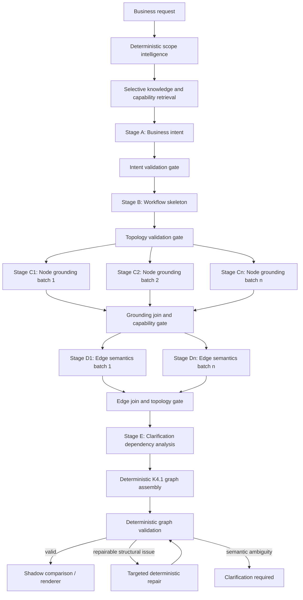

# P1 — Distributed Planner Architecture Study

## Executive decision

Yes: redesign the grounded planner around distributed reasoning, while preserving the K4.1 execution graph as the final planner contract.

The recommended architecture is not a collection of autonomous agents. It is a typed, bounded orchestration pipeline in which AI performs only business-semantic decisions and deterministic software owns identifiers, graph construction, capability enforcement, validation, retries, caching, and promotion policy.

K4.2 established that a compact single-call planner still asks Qwen 3 8B to solve too many reasoning and serialization problems at once. Splitting those responsibilities reduces per-call context, limits failure blast radius, permits selective retry, supports different models by stage, and keeps the final graph deterministic.

K5 must not begin. P1 is an architecture recommendation only.

## Evidence from K4.1 and K4.2

- K4.1 established the correct final representation: explicit nodes, edges, conditions, routes, merges, loops, retries, grounding, and clarification blockers.
- K4.2 reduced the Asana CRM prompt from 21,114 to 17,438 characters, yet Qwen 3 8B completed 0 of 6 live scenarios within the 30-second evaluation bound.
- The local provider did not always settle when its HTTP abort signal expired, so runtime isolation must exist above the provider.
- Failures occurred before parsing and graph validation. The primary problem is generation workload, not deterministic validation cost.
- Further compression alone offers diminishing returns and increases the risk of hiding business semantics.

## Single planner versus distributed planner

| Concern | Single planner | Distributed planner |
|---|---|---|
| Failure blast radius | Entire graph is lost | Failed stage or item can be retried |
| Prompt growth | Scope, catalog, evidence, schema, and graph all grow together | Each stage receives only relevant slices |
| Large workflows | Generation and JSON reliability degrade with node count | Node groups can be bounded and parallelized |
| Validation | Mostly post-generation | Continuous deterministic checks between stages |
| Model choice | One model must do everything | Model can be selected by stage |
| Cache reuse | Limited | Facts, intent, skeleton, and grounding can have separate keys |
| Debugging | One opaque failure | Stage-specific diagnostics and artifacts |
| Consistency risk | Internally generated in one pass | Requires strict stage contracts and deterministic assembly |
| Operational complexity | Lower initially | Higher, but bounded and observable |
| 100 apps / 1,000 operations | Large capability context | Retrieval and grounding remain local to nodes |

The distributed planner scales better, provided it remains an orchestrated typed pipeline rather than an open-ended agent system.

## Responsibility boundary

### AI responsibilities

AI should perform decisions that require interpretation:

- summarize business intent without inventing policy
- decompose intent into business steps
- select relevant workflow patterns
- propose semantic sequencing and meaningful branches
- choose among already-retrieved supported operations
- map business fields to operation inputs
- describe business conditions and route meaning
- identify semantic ambiguity requiring clarification
- explain platform trade-offs using supplied limitations

### Deterministic responsibilities

Software should own:

- node IDs and edge IDs
- normalization and deduplication
- graph assembly
- stage orchestration and deadlines
- schema validation
- capability and reference validation
- application and operation allowlists
- cardinality compatibility
- reachability
- binary TRUE/FALSE completeness
- router route completeness
- loop boundaries and termination declarations
- merge inputs and continuation
- retry boundaries and separation from business loops
- clarification blocking
- evidence-link verification
- cache keys and invalidation
- retry eligibility
- partial-result quarantine
- final K4.1 serialization
- persistence and promotion policy

AI proposes semantic fragments. Software assembles the execution graph.

## Distributed Planner Architecture v2



### Core components

1. **Planner Orchestrator**
   Runs a versioned execution manifest, deadlines, cancellation, dependency scheduling, retries, and diagnostics.

2. **Stage Adapters**
   Provide typed AI requests and validate typed stage responses. They do not assemble the final graph.

3. **Context Slicer**
   Selects facts, evidence references, patterns, knowledge, and capabilities for one stage or node group.

4. **Deterministic Resolvers**
   Generate stable identifiers, resolve references, verify cardinality and capabilities, and normalize stage outputs.

5. **Artifact Store**
   Stores ephemeral, versioned shadow artifacts and cache entries. It is separate from persisted production workflows.

6. **Graph Assembler**
   Converts validated stage artifacts into the unchanged K4.1 execution graph.

7. **Graph Validator**
   Retains existing K4.1 deterministic validation and adds stage-completeness checks.

## Pipeline stages

Estimates are initial budgets for Qwen 3 8B evaluation, not performance promises.

### Pre-stage — Scope intelligence and retrieval

- **Purpose:** deterministically segment the request; detect facts, evidence, patterns, clarifications, applications, entities, cardinality, and candidate capabilities.
- **Inputs:** raw scope, selected platform, catalog/detector versions.
- **Outputs:** existing planning facts, compact evidence references, clarification candidates, retrieved IDs, capability subsets.
- **Failure modes:** detector exception, catalog inconsistency, context budget exceeded.
- **Retry:** no AI retry; deterministic retry only after configuration/catalog correction.
- **Cache:** safe by scope hash, catalog version, detector version, platform.
- **Prompt:** none.
- **Latency target:** under 100 ms for typical scopes; benchmark separately for very large scopes.

### Stage A — Business intent

- **Purpose:** convert detected facts into a concise statement of goals, actors, business outcomes, invariants, and prohibited assumptions.
- **Inputs:** segmented scope, detected facts, clarification candidates, relevant pattern IDs.
- **Outputs:** `BusinessIntent`, including goals, outcomes, invariants, ambiguities, and fact/evidence references.
- **Failure modes:** lost business goal, invented policy, invalid reference, ambiguous intent.
- **Retry:** once with validator feedback limited to missing or invalid intent fields.
- **Cache:** safe if scope, fact set, pattern set, stage prompt, and model identity match.
- **Estimated prompt:** 2,000–5,000 characters.
- **Estimated local latency:** 3–15 seconds; must be measured.

### Stage B — Workflow skeleton

- **Purpose:** define semantic nodes and topology without applications, operations, detailed fields, or final IDs.
- **Inputs:** validated intent, relevant patterns, clarification blockers, required canonical functions.
- **Outputs:** ordered semantic node keys, canonical function proposals, branch topology, loop/merge declarations, business sequencing, unresolved grounding slots.
- **Failure modes:** missing branch, unnecessary node, lost goal, invalid loop/merge topology, invented business rule.
- **Retry:** targeted topology retry; Stage A is reused unless intent validation failed.
- **Cache:** safe by validated intent hash, pattern versions, stage version, platform-neutral topology policy.
- **Estimated prompt:** 3,000–7,000 characters.
- **Estimated local latency:** 5–20 seconds.

### Stage C — Node grounding

- **Purpose:** ground one node or a small dependency-aware group to verified applications, operations, inputs, outputs, capabilities, knowledge, limitations, and blockers.
- **Inputs:** one skeleton slice, local predecessor/successor semantics, retrieved operation candidates, cardinality facts, platform capabilities.
- **Outputs:** `GroundedNodeFragment` values keyed by semantic node key.
- **Failure modes:** unsupported operation, wrong application, cardinality mismatch, missing required input, invented mapping, unresolved ambiguity.
- **Retry:** retry only the failed node group with deterministic validator feedback; never restart Stage A or B for a local grounding failure.
- **Cache:** safe per semantic node hash, local context hash, catalog version, platform capability version, stage/model version.
- **Estimated prompt:** 2,000–6,000 characters per group.
- **Estimated local latency:** 3–15 seconds per group.

### Stage D — Edge grounding

- **Purpose:** assign business meaning to proposed topology: conditions, labels, route meaning, purposes, business reasons, rules, and evidence.
- **Inputs:** validated skeleton edges, grounded endpoint summaries, decision/route facts, evidence references, pattern constraints.
- **Outputs:** `GroundedEdgeFragment` values keyed by semantic edge key.
- **Failure modes:** missing false path, route mismatch, meaningless condition, evidence mismatch, invented policy.
- **Retry:** retry only the failed edge group; topology change is escalated back to Stage B rather than patched locally.
- **Cache:** safe per edge semantic hash, endpoint grounding hashes, evidence set, stage/model version.
- **Estimated prompt:** 1,500–5,000 characters per group.
- **Estimated local latency:** 2–12 seconds per group.

### Stage E — Clarification dependency analysis

- **Purpose:** determine exactly which unresolved clarification blocks which nodes, edges, routes, or the entire plan.
- **Inputs:** existing deterministic clarifications, intent, skeleton, validated node/edge fragments.
- **Outputs:** blocker bindings and non-blocking assumptions; no invented answers.
- **Failure modes:** dropped clarification, excessive blocking, assumption presented as fact.
- **Retry:** once with a deterministic list of unbound required clarifications; otherwise fail safely.
- **Cache:** safe by clarification set and hashes of referenced fragments.
- **Estimated prompt:** 1,000–3,000 characters.
- **Estimated local latency:** 2–8 seconds.

### Deterministic assembly and validation

- **Purpose:** assign IDs, normalize references, assemble the complete K4.1 graph, and validate it.
- **Inputs:** validated stage artifacts.
- **Outputs:** K4.1 `StructuredWorkflowPlan` or structured failure report.
- **Failure modes:** duplicate semantic keys, dangling reference, unreachable node, invalid boundary declaration, incompatible cardinality.
- **Retry:** deterministic repair for identifiers or normalizable structure; semantic defects return to the owning stage only.
- **Cache:** assembly output may be cached in shadow storage by all artifact hashes, but must not be reused across materially different requests.
- **Prompt:** none.
- **Latency target:** under 100 ms for typical graphs.

## Stage contracts

The following are conceptual public contracts. Field names may be refined before implementation.

```ts
interface PlannerArtifactHeader {
  artifactId: string;
  artifactType: 'intent' | 'skeleton' | 'node-grounding' | 'edge-grounding' | 'clarification-bindings';
  contractVersion: string;
  stageVersion: string;
  promptVersion: string;
  modelId: string;
  scopeHash: string;
  catalogVersion: string;
  detectorVersion: string;
  platform: Platform;
  dependencyArtifactIds: string[];
}

interface BusinessIntent {
  header: PlannerArtifactHeader;
  goals: IntentGoal[];
  outcomes: BusinessOutcome[];
  invariants: BusinessInvariant[];
  unresolvedAmbiguityIds: string[];
  factIds: string[];
  evidenceIds: string[];
}

interface WorkflowSkeleton {
  header: PlannerArtifactHeader;
  entryKey: string;
  nodes: SemanticNode[];
  edges: SemanticEdge[];
  binaryConditions: SkeletonBinaryCondition[];
  routers: SkeletonRouter[];
  merges: SkeletonMerge[];
  loops: SkeletonLoop[];
  retryRequirements: SkeletonRetryRequirement[];
}

interface GroundedNodeFragment {
  header: PlannerArtifactHeader;
  semanticNodeKey: string;
  canonicalFunctionId: string;
  applicationRef: string | null;
  operationRef: string | null;
  inputs: string[];
  outputs: string[];
  factIds: string[];
  patternIds: string[];
  knowledgeIds: string[];
  capabilityIds: string[];
  blockedByClarificationIds: string[];
  limitationAcknowledgements: string[];
}

interface GroundedEdgeFragment {
  header: PlannerArtifactHeader;
  semanticEdgeKey: string;
  sourceNodeKey: string;
  targetNodeKey: string;
  condition: string | null;
  label: string;
  purpose: string;
  businessReason: string;
  ruleId: string;
  evidenceIds: string[];
}

interface ClarificationBindings {
  header: PlannerArtifactHeader;
  bindings: Array<{
    clarificationId: string;
    blockedArtifactKeys: string[];
    scope: 'node' | 'edge' | 'route' | 'workflow';
    reason: string;
  }>;
}
```

### Planner orchestration API

```ts
interface DistributedPlannerRequest {
  requestId: string;
  objective: string;
  platform: Platform;
  analysis: DetectedProcessSummary;
  executionPolicy: {
    overallDeadlineMs: number;
    perStageDeadlineMs: Partial<Record<PlannerStage, number>>;
    maximumAttemptsPerStage: number;
    maximumParallelGroundings: number;
    contextBudgetPerCall: number;
    outputBudgetPerCall: number;
  };
  signal?: AbortSignal;
}

interface DistributedPlannerResult {
  status: 'completed' | 'blocked' | 'failed' | 'cancelled';
  graph: StructuredWorkflowPlan | null;
  artifacts: PlannerArtifactSummary[];
  blockers: ClarificationBindingSummary[];
  diagnostics: PlannerRunDiagnostics;
}
```

Production should initially receive only the existing shadow comparison. Detailed artifacts belong in development diagnostics or an internal evaluation store, not persisted workflow data.

## Failure and retry architecture

### Failure ownership

| Failure | Owning boundary | Restart scope |
|---|---|---|
| Intent misses explicit business goal | Stage A | Stage A, then invalidate downstream |
| Skeleton topology invalid | Stage B | Stage B only, then invalidate C–E |
| One unsupported operation | Stage C node group | Failed group only |
| Cardinality mismatch | Stage C node group | Failed group; Stage B only if topology must add iterator/aggregator |
| Edge lacks FALSE path | Stage D if edge omission; Stage B if topology omission | Failed edge group or Stage B |
| Clarification not bound | Stage E | Stage E only |
| Duplicate generated ID | Assembly | Deterministic repair only |
| Dangling semantic key | Producing stage | Failed fragment only |
| Provider unavailable | Orchestrator | Retry eligible stage or stop |
| Overall deadline | Orchestrator | Cancel pending work; return no graph |

### Retry rules

- Every attempt is bounded by stage and overall deadlines.
- Retry only the smallest invalid artifact.
- Retry prompts contain validator issue codes, not the entire previous conversation.
- A retry cannot broaden allowed applications, operations, functions, or business policies.
- Two identical failures open a circuit for that stage/model/request.
- Upstream artifact changes invalidate all dependent downstream artifacts.
- Cancellation quarantines late provider responses.
- A graph is assembled only from artifacts belonging to the same run manifest and version set.

Stage C failure must not restart Stage A unless the error reveals that the intent itself was wrong. Local operation selection failures remain local.

## Cache boundaries

| Artifact | Cacheable | Required key material |
|---|---|---|
| Scope segmentation and facts | Yes | scope hash, detector version |
| Knowledge retrieval IDs | Yes | fact hash, catalog version, retrieval version, platform |
| Business intent | Yes | fact/evidence hash, prompt/model/stage version |
| Workflow skeleton | Yes | intent hash, patterns, topology policy version |
| Node grounding | Yes per node/group | semantic node hash, neighbor context, catalog/capability/platform/model versions |
| Edge grounding | Yes per edge/group | edge hash, endpoint grounding hashes, evidence hash |
| Clarification bindings | Yes | clarification hash and artifact hashes |
| Final AI output across different requests | No | not applicable |
| Deterministically assembled graph | Shadow cache only | complete run-manifest hash |

Cache entries should be immutable, content-addressed, size-bounded, encrypted if persisted, and subject to TTL. Private scope text should not appear in cache keys or normal logs.

## Parallelism

### Node grounding

Node grounding can run in parallel after Stage B, grouped by dependency and shared business context. Independent route branches are strong candidates. A bounded worker pool is required to avoid overloading local Ollama; for one local GPU, concurrency may remain one while still benefiting from independent retries and caching.

### Edge grounding

Edges can run in parallel after their endpoint nodes are grounded. Binary-condition and router edge groups must remain atomic so TRUE/FALSE or all routes are evaluated together.

### Streaming assembly

Software may allocate stable node IDs and validate completed fragments while later fragments are still running. It must not publish, persist, or render a graph as complete until:

- every required artifact has completed
- all declared dependencies match the run manifest
- clarification blockers are bound
- graph assembly and full validation pass

Incremental assembly is useful for early diagnostics, not partial promotion.

### Scheduling model

Use a dependency DAG:

```text
scope/retrieval
      ↓
    intent
      ↓
   skeleton
      ↓
node groups ─────────┐
      ↓              │
edge groups          │
      ↓              │
clarification binding│
      └──────────────┘
              ↓
          assembly
              ↓
          validation
```

## Model strategy

Stage contracts must be model-neutral. A model profile selects a provider per stage without changing the artifacts:

- deterministic software: retrieval, assembly, validation, repair
- small local model: concise intent extraction or simple skeletons after benchmarking
- Qwen 3 8B: bounded skeleton or node-grounding tasks
- larger local model: complex topology or ambiguous operation selection
- optional remote model: explicitly configured fallback for selected stages, never silent

Model substitutions require:

- identical stage contract
- provider/model recorded in artifact headers
- stage-specific acceptance benchmarks
- no cross-provider fallback without user configuration
- deterministic capability allowlists applied after every model

The architecture should not assume that the “larger” model performs every stage better. Selection must be benchmark-driven.

## Scalability assessment

### 100 applications and 1,000 operations

The planner must never send the full catalog. Retrieval should operate in layers:

1. detected application candidates
2. canonical-function candidates
3. application operation candidates
4. platform capability and limitation candidates
5. node-local reranking

Stage C then receives typically 3–10 operation candidates per semantic node rather than 1,000 operations.

### 100 patterns

Deterministic pattern retrieval should select a small set from explicit signals. Stage A or B may choose among retrieved patterns but cannot invent pattern IDs.

### Very large scopes

Segment facts by business process and preserve cross-process dependencies. Stage A may produce several intent domains; Stage B can skeletonize domains independently when the request states independent workflows. This must not silently introduce workflow sets before their dedicated migration sprint.

### Very large graphs

Bound node grounding groups by semantic cohesion and context size. Validate branches locally, then validate global reachability after assembly. Complexity grows approximately with selected nodes and edges instead of with the entire catalog multiplied by the entire scope.

## Risks of distributed planning

1. **Cross-stage semantic drift**
   Mitigation: immutable typed artifacts, dependency hashes, and validators.

2. **Excessive latency from sequential stages**
   Mitigation: small prompts, cache reuse, parallel node/edge groups, and early deterministic gates.

3. **More orchestration complexity**
   Mitigation: one orchestrator and explicit state machine, not peer-to-peer agents.

4. **Inconsistent model outputs**
   Mitigation: model-neutral contracts and deterministic normalization.

5. **Cache staleness**
   Mitigation: content-addressed version keys and dependency invalidation.

6. **Retry storms**
   Mitigation: bounded attempts, circuit breakers, global deadline, and category-based eligibility.

7. **Partial-plan leakage**
   Mitigation: shadow artifact store separated from workflows; promotion only after final validation.

8. **Topology changes discovered during grounding**
   Mitigation: explicit escalation from Stage C/D to Stage B and downstream invalidation.

## Versioning strategy

Use independent semantic versions:

- planner run-manifest version
- stage contract version
- stage implementation version
- prompt version
- detector version
- catalog version
- capability version
- graph contract version

Artifact readers must reject unsupported major versions. Minor versions are additive. Patch versions cannot change semantics.

The K4.1 graph remains version `1.1` during initial migration. Distributed planning changes how that graph is produced, not what it means.

## Migration strategy

### P1 — Architecture study

Current phase. No application code changes.

### P2 — Orchestrator and contracts in shadow

Add artifact contracts, a run manifest, deterministic ID allocation, and a stage state machine. Use deterministic fixtures only. Production and K4.2 remain unchanged.

### P3 — Stage A and B shadow experiment

Run intent and skeleton calls on the existing benchmark corpus. Do not perform node/edge grounding. Measure completion, semantic retention, and latency.

### P4 — Node grounding

Add bounded per-node/group grounding, capability validation, caching, and selective retry.

### P5 — Edge grounding and clarification bindings

Add atomic branch/route groups and clarification dependencies.

### P6 — Deterministic assembly

Assemble the unchanged K4.1 graph and compare it with current K4.2 shadow output.

### P7 — Distributed planner acceptance

Run at least the existing 20 deterministic scenarios and six live scenarios. Require stage and end-to-end reliability thresholds before controlled promotion is considered.

At every phase:

- production planner behavior remains unchanged
- artifacts are shadow-only
- no partial graph is persisted
- rollback disables the new orchestrator
- approval is required before the next phase

## Acceptance criteria for a future implementation plan

Before implementation, define:

- at least 90% completion for each AI stage on the six live scenarios
- at least 90% end-to-end completion
- zero unsupported references
- 100% final deterministic graph-validation pass rate for completed runs
- no lost required clarification
- no partial persistence
- bounded p95 stage and total latency
- measurable cache-hit benefit
- exact invalidation behavior
- production isolation tests

End-to-end reliability is multiplicative. Five stages at 90% each produce only about 59% theoretical end-to-end reliability if failures are independent. Therefore individual stage targets likely need to be 98% or better, or deterministic fallbacks must eliminate some AI stages.

## Final recommendation

Redesign the planner around a distributed, typed reasoning pipeline.

Do not implement it as autonomous agents. Use one deterministic orchestrator, narrow AI stage adapters, immutable artifacts, content-addressed caches, selective retries, and deterministic K4.1 graph assembly.

The safest next step, after approval, is not full implementation. It is a P2 contract-and-orchestrator sprint followed by a P3 Stage A/B live experiment. That experiment should prove that bounded skeleton generation is reliable on Qwen 3 8B before node and edge grounding are built.

K5 should remain paused.
