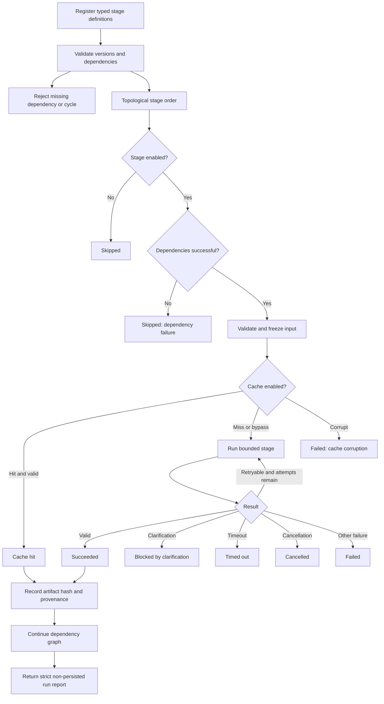

# P2 Distributed Planner Delivery Report

## Delivery status

P2 is complete at its approval boundary.

Implemented:

- strict versioned contracts for Stages A–F
- deterministic stage registry and dependency ordering
- lifecycle state machine
- stage and pipeline deadlines
- cancellation and cleanup boundaries
- stage-specific selective retries
- content-addressed cache interfaces and in-memory implementation
- cache integrity verification and version invalidation
- immutable inputs
- model-neutral runners
- structured provenance, diagnostics, failures, and run reports
- deterministic Asana CRM orchestration benchmark
- disabled-by-default environment controls

Not implemented:

- live Stage A or Stage B execution
- Qwen or any other model runner for the distributed pipeline
- application-route integration
- persistence
- P3
- K5

## Architecture summary

P2 implements a typed orchestration framework, not an autonomous multi-agent system. Stages exchange only schema-validated artifacts. They do not communicate through free-form conversations.

The orchestrator:

1. validates registration, contract versions, dependency versions, missing dependencies, and cycles
2. computes a deterministic topological order
3. skips disabled stages
4. blocks downstream work after dependency failures while continuing unrelated work
5. creates and validates immutable stage inputs
6. computes a content-addressed cache key
7. validates cached output integrity and stage schema
8. executes a model-neutral runner inside stage and pipeline deadlines
9. retries only locally eligible failures
10. validates the output contract
11. records artifact provenance and diagnostics
12. returns a strict, non-persisted pipeline report

The existing K4.1 `StructuredWorkflowPlan` version `1.1` remains the unchanged final graph contract.

## Stage contracts implemented

All contracts use distributed planner contract version `2.0.0`.

### Stage A — Business Intent Interpretation

Input:

- run ID
- raw scope
- K3.1 planning facts
- clarifications
- platform
- relevant knowledge references

Output:

- business objective
- actors
- systems
- business outcomes
- constraints
- unresolved questions and blocking state
- decomposition hints
- fact and knowledge references

### Stage B — Workflow Skeleton

Input:

- Stage A business intent
- platform
- pattern IDs
- required canonical functions

Output:

- entry and exits
- canonical node placeholders
- semantic edges
- binary conditions
- routers and routes
- loop boundaries
- merge points
- blocking clarification IDs

It contains no full operation grounding.

### Stage C — Node Grounding

Input:

- one semantic node
- predecessor and successor keys
- allowed applications, operations, and canonical functions
- facts, patterns, knowledge, and capabilities

Output:

- canonical function
- verified application and operation references
- inputs and outputs
- grounding references
- clarification blockers
- limitations and alternatives

Separate Stage C instances support independently retryable future node-grounding tasks.

### Stage D — Edge Grounding

Input:

- semantic edge
- grounded endpoints
- decision facts
- evidence and pattern references

Output:

- source and target keys
- source and target handles
- label and condition
- purpose and business reason
- rule and evidence references

### Stage E — Deterministic Assembly

Input:

- objective and platform
- validated skeleton
- grounded node artifacts
- grounded edge artifacts
- clarification blockers

Output:

- complete unchanged K4.1 execution graph

Stage E is deterministic and does not require AI.

### Stage F — Deterministic Validation

Input:

- assembled K4.1 graph

Output:

- validity
- issue codes
- graph only when valid

Stage F is deterministic and will own final distributed-planner validation integration in a later approved phase.

## Orchestrator lifecycle

## State transition rules

| From | Allowed destinations |
|---|---|
| `pending` | `ready`, `skipped`, `cancelled`, `blocked-by-clarification` |
| `ready` | `running`, `cache-hit`, `skipped`, `cancelled`, `blocked-by-clarification` |
| `running` | `succeeded`, `failed`, `timed-out`, `cancelled`, `blocked-by-clarification` |
| `succeeded` | terminal |
| `failed` | terminal |
| `timed-out` | terminal |
| `cancelled` | terminal |
| `skipped` | terminal |
| `blocked-by-clarification` | terminal |
| `cache-hit` | terminal |

Invalid transitions throw deterministic orchestration errors.

## Failure taxonomy

- `invalid-input`
- `invalid-output`
- `dependency-failure`
- `timeout`
- `cancellation`
- `provider-unavailable`
- `provider-connection-failure`
- `malformed-model-output`
- `unsupported-capability`
- `blocking-clarification`
- `cache-corruption`
- `orchestration-error`
- `unknown`

Every failure records:

- stage instance ID
- stable stage ID
- stage version
- retryability
- retry count
- cause
- safe user explanation
- structured diagnostic details
- whether a direct downstream stage was skipped

## Selective retry behavior

Retry policy belongs to each stage instance:

- maximum retries
- eligible failure categories

The orchestrator retries only when:

1. the failure declares itself retryable
2. its category appears in the stage allowlist
3. attempts remain

Blocking clarification and unsupported capability are non-retryable. Timeout retries occur only if explicitly configured. A Stage C or D failure retries only that instance; successful upstream artifacts do not restart.

The Asana benchmark proves that one failed Google Drive grounding task runs twice while intent, skeleton, and other grounding tasks run once.

## Cache-key and invalidation design

The SHA-256 content-addressed key includes:

- normalized scope hash
- stage instance ID
- stable stage ID
- stage version
- detector version
- catalog version
- input contract version
- selected platform
- upstream output hashes
- model identity, when applicable
- canonical input hash

Cache behavior:

- miss executes the stage
- hit validates content integrity and the current output schema
- stage/version/input/upstream/model changes naturally create a new key
- explicit bypass is supported per run and per stage
- explicit invalidation is supported by key or complete cache clear
- hash mismatch is classified as `cache-corruption`

P2 uses an in-memory cache. It never writes model or stage output into project storage.

## Concurrency boundaries

- Future parallel work is declared with a `parallelGroup`.
- The execution policy requires `maximumConcurrency >= 1`.
- Default configured concurrency is 2.
- P2 deliberately uses deterministic sequential scheduling, which always stays within the configured ceiling.
- Stage C node instances and Stage D edge groups are already independently addressable, retryable, and cacheable.
- Aggressive parallel scheduling is deferred until a later approved phase because local Ollama may need concurrency 1 even when remote providers can support more.

## Environment variables

| Variable | Default |
|---|---:|
| `P2_DISTRIBUTED_PLANNER` | `false` |
| `P2_DISTRIBUTED_PLANNER_TOTAL_TIMEOUT_MS` | `300000` |
| `P2_DISTRIBUTED_PLANNER_STAGE_TIMEOUT_MS` | `60000` |
| `P2_DISTRIBUTED_PLANNER_MAX_RETRIES` | `1` |
| `P2_DISTRIBUTED_PLANNER_CONCURRENCY` | `2` |
| `P2_DISTRIBUTED_PLANNER_CACHE` | `true` |

`P2_DISTRIBUTED_PLANNER=false` is the default. The production application does not invoke the distributed orchestrator in P2.

## Asana CRM mock orchestration benchmark

Scenario:

- Stage A interprets an Asana CRM objective.
- Stage B produces a trigger → Google Drive folder → Asana subtask skeleton.
- Three independent Stage C node-grounding instances represent the trigger, folder, and subtask.
- Two independent Stage D instances ground the edges.
- The Google Drive folder grounding fails once with simulated malformed output.
- Only that grounding task retries.
- Stage E waits for the skeleton, all three node artifacts, and both edge artifacts.
- Stage F validates the assembled result.

Results:

- Stage A attempts: 1
- Stage B attempts: 1
- Asana trigger grounding attempts: 1
- Google Drive folder grounding attempts: 2
- Asana subtask grounding attempts: 1
- each edge grounding attempts: 1
- assembly began only after all required dependencies
- final graph contract: K4.1 version `1.1`
- final report: complete and auditable
- persistence: false
- live model calls: zero

## Exact files created

- `packages/shared/src/distributed-planner.ts`
- `packages/shared/src/distributed-planner.test.ts`
- `apps/server/src/distributed-planner/stage-lifecycle.ts`
- `apps/server/src/distributed-planner/stage-cache.ts`
- `apps/server/src/distributed-planner/distributed-planner-orchestrator.ts`
- `apps/server/src/distributed-planner/distributed-planner-orchestrator.test.ts`
- `apps/server/src/distributed-planner/asana-crm-orchestration-benchmark.test.ts`
- `outputs/p2-distributed-planner-delivery-report.md`

## Exact files modified

P2 contracts and configuration:

- `.env.example`
- `packages/shared/src/index.ts`
- `apps/server/src/config/environment.ts`
- `apps/server/src/config/environment.test.ts`
- `apps/server/src/app.test.ts`

Behavior-neutral lint cleanup completed during delivery verification:

- `apps/server/src/ai/providers/ollama-provider.ts`
- `apps/server/src/ai/providers/openai-provider.ts`
- `apps/server/src/analysis/scope-intelligence.ts`
- `apps/server/src/planner/k4-shadow-benchmark.test.ts`
- `apps/server/src/planner/planner-prompt-builder.ts`

The lint cleanup removes unused imports and replaces explicit `any` types. It does not change prompts, providers, or workflow behavior.

## Complete verification results

### Tests

| Workspace | Passed | Skipped |
|---|---:|---:|
| Shared | 28 | 0 |
| Knowledge | 8 | 0 |
| Platforms | 8 | 0 |
| Server | 141 | 2 |
| Client | 4 | 0 |
| **Total** | **189** | **2** |

The skipped server cases are opt-in K4.2 live Ollama benchmarks. They were intentionally not executed during P2 because P2 prohibits live AI stages.

### Lint

`npm run lint`: passed with zero errors and zero warnings.

### Type-check

`npm run typecheck`: passed for shared, knowledge, platforms, server, and client.

### Production build

Production builds passed for shared, knowledge, platforms, server, and client.

The client retains the pre-existing bundle-size warning:

- main bundle approximately 1.03 MB before gzip

This warning is unrelated to P2.

## Backward-compatibility verification

- Existing production workflow generation is unchanged.
- Existing Qwen/Ollama planner prompts are unchanged.
- Existing K4 and K4.2 shadow behavior is unchanged.
- K4.1 graph version `1.1` is unchanged.
- No database migration was added.
- No persisted workflow or project schema was changed.
- Shared-package additions are additive exports.
- Existing K1–K4.2 tests remain passing.
- The distributed planner is not wired into production analysis routes.

## Persistence verification

- The orchestrator has no repository or database dependency.
- Stage cache storage is in-memory only.
- Pipeline reports require `persisted: false`.
- The Asana CRM benchmark confirms `persisted: false`.
- No project, workflow, workflow version, or analysis record is mutated.

## Rollback instructions

No application rollback is required while the default remains unchanged.

1. Keep `P2_DISTRIBUTED_PLANNER=false`.
2. Restart the server after environment changes.
3. Current production analysis and K4 shadow planning continue unchanged.
4. If the P2 source foundation itself must be removed, revert the P2 commit; there is no data migration or cache cleanup requirement.

The in-memory stage cache disappears automatically when the server process ends.

## Known limitations and newly discovered risks

1. **Sequential scheduler**
   P2 declares parallel groups and validates concurrency settings but does not yet execute stages concurrently.

2. **No live-stage integration**
   The feature flag is defined and disabled, but enabling it does not invoke a live distributed pipeline. P3 must explicitly wire a shadow experiment.

3. **No provider runners**
   Only model-neutral deterministic mocks exist. Qwen, another local model, and remote runners require later approved adapters.

4. **Cooperative resource cleanup**
   The orchestrator returns safely at timeout or cancellation even if a runner ignores its signal. It cannot forcibly terminate arbitrary in-process work; late results are quarantined and ignored.

5. **In-memory cache only**
   Cache entries do not survive restarts and have no TTL or size eviction yet.

6. **Cached provenance**
   Cache-hit reports preserve the artifact's original provenance. A future report may also need separate “reused in run” provenance.

7. **Direct downstream flag**
   `downstreamSkipped` currently reports direct skipped dependents. A future diagnostics enhancement may include the full transitive dependency impact.

8. **No production UI**
   P2 diagnostics are typed internal reports only.

9. **Final Stage F integration**
   The deterministic contract exists and the mock benchmark uses it, but existing K4.1 graph-validator integration into Stage F belongs to a later approved implementation step.

10. **End-to-end reliability remains unmeasured**
    P2 intentionally contains no live AI execution. P3 must benchmark Stage A/B before further expansion.

## Explicit confirmations

- No live AI stage was executed.
- No Qwen prompt changed.
- No production workflow-generation behavior changed.
- No distributed planner output was persisted.
- The distributed planner remains disabled by default.
- P3 has not started.
- K5 has not started.

## Recommended Git commit message

`feat(analysis): add P2 distributed planner contracts and orchestrator foundation`
