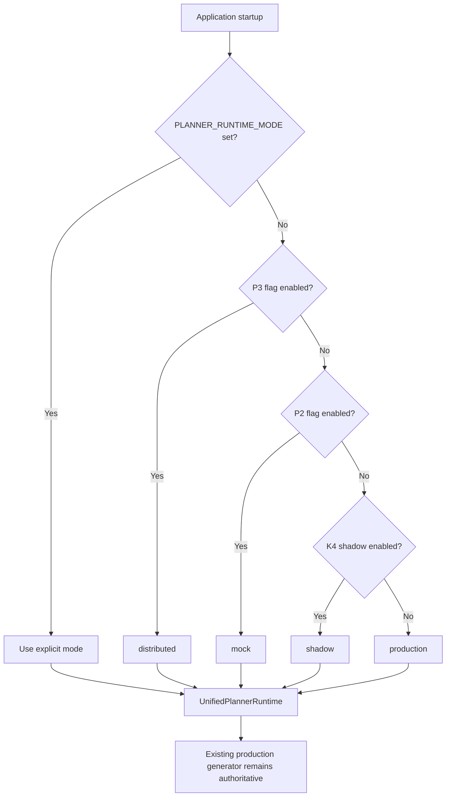

# P3.6 — Controlled Vocabulary Integration and Planner Consolidation

## Decision

**ONE FINAL REVISION REQUIRED**

The infrastructure consolidation is complete and releasable because it is additive, disabled by default, and does not change production workflow generation. It is not yet ready for P4 promotion: live Qwen Stage A/B benchmarking still exposes semantic role swaps and incomplete execution topology that deterministic symbol validation alone cannot detect.

## Architecture summary

P3.6 introduces one planner control plane without replacing the stable production generator:

- `UnifiedPlannerRuntime` is the single runtime entry point.
- Configuration selects `production`, `shadow`, `distributed`, or `mock`.
- Stable catalog IDs remain authoritative inside the application.
- AI-facing Stage A/B messages use deterministic, per-run numeric symbol references.
- Software resolves numeric references, rejects unknown symbols, and generates structural IDs.
- The unchanged K4.1 execution graph remains the resolved planner artifact.
- Planner artifacts and symbol handles remain analysis-only and are not persisted.
- Model access is injected through the provider-neutral stage-runner factory.

This is a consolidation of the control plane, not a deletion of proven implementations. The K4 shadow implementation and P2/P3 orchestration internals remain behind adapters to preserve compatibility.

## Planner consolidation report

| Mode | Behavior | AI execution | Persistence | Default |
|---|---|---:|---:|---:|
| `production` | Existing production workflow generation only | Existing production provider path | Existing behavior only | Yes |
| `shadow` | Existing K4 comparison adapter | As configured by existing K4 path | No planner artifact persistence | No |
| `distributed` | P3 Stage A/B orchestration using controlled references | Provider-neutral runner | No | No |
| `mock` | Deterministic orchestration comparison | No | No | No |

Mode precedence:

1. Explicit `PLANNER_RUNTIME_MODE`
2. P3 live experiment flag → `distributed`
3. P2 distributed planner flag → `mock`
4. K4 shadow flag → `shadow`
5. Otherwise → `production`

Legacy feature flags continue to work. The explicit mode is the preferred maintenance-mode control.

## Controlled vocabulary implementation report

The shared contracts define a versioned symbol table with these namespaces:

- application
- canonical function
- pattern
- capability
- clarification
- fact
- evidence
- knowledge

Each table is:

- deterministic for identical inputs;
- namespace-scoped;
- versioned;
- content-addressed with a SHA-256 snapshot;
- resolvable in both directions;
- strict at the AI boundary.

P3.6 Stage A/B wire contracts use numeric handles and array indexes. Free-form stable IDs are not accepted from the model. Dynamic JSON Schema enums restrict each numeric field to the symbols available for that run. Unknown handles, invalid indexes, and invalid topology are classified as retryable invalid-output failures.

Stable IDs are restored before producing the existing K4.1 graph. Numeric symbols never become a second persisted workflow representation.

## Runtime mode diagram

## Model-neutral execution boundary

`ProviderPlannerStageRunnerFactory` adapts the existing `AnalysisProvider` interface to the distributed planner stage-runner contract. The P3 experiment no longer constructs a Qwen-specific runner.

The Ollama implementation remains one provider implementation. Planner-only requests use their supplied output schema as Ollama's structured-output format. The existing production workflow analysis method, prompt, and JSON response mode are unchanged.

## Migration summary

- Database migration: none.
- Persisted workflow schema migration: none.
- K4.1 graph contract migration: none.
- Existing import migration: none required for consumers.
- Environment migration: optional only.
- Rollback: remove or unset `PLANNER_RUNTIME_MODE` and keep all planner feature flags false. Startup selects `production`.

## Files created

- `packages/shared/src/controlled-vocabulary.ts`
- `packages/shared/src/p3-6-planner.ts`
- `packages/shared/src/controlled-vocabulary.test.ts`
- `apps/server/src/planner/controlled-vocabulary.ts`
- `apps/server/src/planner/controlled-vocabulary.test.ts`
- `apps/server/src/planner/planner-runtime-service.ts`
- `apps/server/src/planner/planner-runtime-service.test.ts`
- `apps/server/src/distributed-planner/provider-stage-runner.ts`
- `apps/server/src/distributed-planner/controlled-output-schema.ts`
- `apps/server/src/distributed-planner/controlled-output-schema.test.ts`
- `outputs/p3-6-controlled-vocabulary-consolidation-report.md`

## Files modified

- `packages/shared/src/index.ts`
- `apps/server/src/app.ts`
- `apps/server/src/app.test.ts`
- `apps/server/src/config/environment.ts`
- `apps/server/src/config/environment.test.ts`
- `apps/server/src/services/analysis-service.ts`
- `apps/server/src/distributed-planner/p3-shadow-experiment.ts`
- `apps/server/src/distributed-planner/p3-shadow-experiment.test.ts`
- `apps/server/src/distributed-planner/p3-live-benchmark.test.ts`
- `apps/server/src/distributed-planner/p3-ollama-stage-runner.ts`
- `apps/server/src/ai/providers/ollama-provider.ts`
- `apps/server/src/ai/providers/ollama-provider.test.ts`
- `.env.example`

## Regression results

Final workspace verification:

| Check | Result |
|---|---|
| Shared tests | 30 passed |
| Knowledge tests | 8 passed |
| Platform tests | 8 passed |
| Server tests | 156 passed; 3 live-only tests skipped |
| Client tests | 4 passed |
| Total | **206 passed** |
| Lint | Passed |
| Type check | Passed |
| Production build | Passed |

The client build retains its pre-existing warning that the main minified chunk exceeds 500 kB. P3.6 adds no client code.

The controlled live benchmark previously reached Stage A for four of six scenarios and Stage B for two of six. Schema-constrained output prevents out-of-vocabulary references, but it does not ensure correct semantic assignment of valid roles. This is the reason for the revision recommendation.

## Backward compatibility verification

- Existing production workflow generation remains the default.
- The production Qwen prompt was not changed.
- The production workflow response contract was not changed.
- K4.1 execution graph contracts were not changed.
- Existing K4 shadow behavior remains available through an adapter.
- Existing P2/P3 feature flags remain accepted.
- No planner output or symbol table is persisted.
- Existing application registry, catalog, adapters, migrations, and saved workflows are unchanged.
- Stage C, Stage D, K5, and workflow sets were not started.

## Known limitations and risks

1. Controlled references prove that a reference exists, not that it is semantically correct in context. A model can select a valid iterator symbol for a trigger role.
2. Execution topology failures still occur in realistic collection and branching scenarios.
3. The live experiment has not met a promotion-quality Stage A/B completion threshold.
4. `P2_DISTRIBUTED_PLANNER=true` maps to deterministic `mock` mode for backward-safe startup. Teams wanting live Stage A/B must explicitly select `distributed` or use the P3 experiment flag.
5. K4, P2, and P3 implementations remain as internal adapters. The runtime entry point is consolidated, but deleting those implementations would create unnecessary regression risk.
6. The server remains the enforcement boundary. Shared contracts intentionally remain platform-neutral.
7. The client bundle-size warning remains technical debt outside this sprint.

## Required revision before P4

Do not add another planner layer. Strengthen the existing semantic validator with role compatibility and topology invariants:

- allowed canonical functions per planner role;
- trigger/action/iterator/router/merge semantic compatibility;
- required branch destinations and merge continuation;
- loop entry/body/exit consistency;
- catalog-operation compatibility after symbol resolution.

Then rerun the same six-scenario live acceptance benchmark and require all structural and semantic checks to pass before controlled promotion.

## Recommended commit message

`feat(analysis): consolidate planner runtime with controlled vocabulary`

## Approval boundary

P3.6 stops here. P4, Stage C, Stage D, and K5 have not begun.
