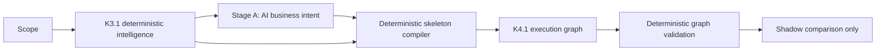

# P4 — Deterministic Skeleton Compiler

## Recommendation

**READY FOR STAGE C**

P4 meets its acceptance objective. AI supplies business intent only. Software constructs and validates workflow topology. Production generation remains unchanged, and the P4 path remains shadow-only and disabled by default.

## Architecture summary

P4 changes the experimental planner responsibility boundary:

AI owns:

- business objective;
- actors and systems;
- business entities and outcomes;
- business rules;
- sequencing hints;
- workflow boundary meaning;
- unresolved clarifications.

Software owns:

- node creation;
- edge creation;
- IDs;
- TRUE/FALSE branches;
- routers and routes;
- iterators;
- loops and loop-back edges;
- merges;
- aggregators;
- delays;
- approval outcomes;
- technical retry boundaries;
- terminal nodes;
- reachability;
- topology validation.

There is no AI Stage B in P4.

## Compiler architecture

`DeterministicSkeletonCompiler` consumes:

- `PlannerContext` built from K3.1 facts;
- entity-scoped cardinality;
- evidence;
- detected patterns;
- clarifications;
- controlled canonical functions;
- optional validated Stage A business intent.

It emits the existing `StructuredWorkflowPlan` version `1.1`. No new graph representation was introduced.

Compilation lifecycle:

1. Create a deterministic trigger.
2. Select applicable pattern compilers from retrieved patterns and deterministic scope signals.
3. Generate nodes, edges, IDs, branch records, loop records, merge records, and retry records.
4. Attach fact, pattern, clarification, and evidence references.
5. Add a successful or clarification-blocked end.
6. Parse through the existing strict K4.1 schema.
7. Run the existing graph validator.
8. Run P4-specific iterator, aggregator, delay, trigger, and end invariants.
9. Reject any compiler defect; never ask AI to repair topology.

IDs are deterministic, sequential, and software-owned:

- `p4-node-001`
- `p4-edge-001`

## Pattern compiler

### Follow Up Until Response

Compiles:

- loop entry;
- follow-up action;
- configured delay boundary;
- loop-back;
- loop exit;
- explicit termination condition;
- clarification blockers for missing interval, attempts, channel, or escalation.

It never uses technical retry for business repetition.

### Create or Update Record

Compiles:

- record search;
- binary decision;
- TRUE update path;
- FALSE create path;
- merge;
- continuation.

### Approved Collection

Compiles:

- human approval;
- approved/rejected binary decision;
- iterator;
- item processing;
- next-item loop;
- collection-complete exit;
- item aggregation;
- rejected handling;
- branch merge;
- result notification.

### Collection Processing

Compiles:

- iterator;
- item path;
- next-item edge;
- iteration-complete edge;
- aggregator.

### Service-Based Routing

Compiles:

- multi-route decision;
- labeled service routes;
- one action per route;
- branch convergence;
- continuation.

When fewer than three explicit route facts are available, the known business example uses Cleaning, Maintenance, and Repair rather than asking AI to invent topology.

### Scheduled Reminder

Compiles:

- delay or schedule boundary;
- notification;
- continuation.

### Human Approval

Compiles:

- approval request;
- approved/rejected binary decision;
- distinct outcomes;
- merge;
- continuation.

### Technical Retry

Compiles:

- technical target operation;
- failure boundary;
- retry edge;
- attempt limit when explicit;
- exhausted edge;
- error handler.

It never creates a business loop.

## Validation guarantees

Compiler output automatically validates:

- unique node and edge IDs;
- entry-node existence;
- reachability;
- grounded nodes and edges;
- TRUE/FALSE ownership and labels;
- router destinations;
- merge inputs and continuation;
- loop entry, body, exit, and termination;
- retry target, exhausted route, and separation from business loops;
- iterator item and completion paths;
- aggregator input from iterator completion;
- delay-boundary meaning;
- triggers without incoming edges;
- end nodes without outgoing edges;
- clarification references;
- no unsupported operation references.

## Runtime integration

The unified runtime still exposes `production`, `shadow`, `distributed`, and `mock`.

In experimental `distributed` mode:

1. P4 runs Stage A through the existing model-neutral stage runner.
2. P4 compiles the graph in software.
3. The runtime returns a shadow comparison.
4. Nothing is persisted.

The frozen P3 implementation remains available internally for historical tests and rollback, but application startup selects P4 for the experimental distributed path.

Production mode remains the default and does not invoke P4.

## Live benchmark

Hardware/model:

- local Ollama;
- Qwen3 8B;
- six existing live scenarios;
- one Stage A call per scenario;
- no AI Stage B.

Results:

| Metric | P3.7 | P4 |
|---|---:|---:|
| Stage A success | 6/6 | 6/6 |
| Valid topology | 0/6 | **6/6** |
| Topology validation rate | 0% | **100%** |
| Topology AI calls | 12 attempts | **0** |
| Retry count | 6 | **0** |
| Total benchmark latency | 1,101.92 s | **204.74 s** |
| Average latency | 183.65 s | **34.12 s** |
| Average P4 compiler time | N/A | **approximately 1.3 ms** |
| Average P4 AI prompt | Stage A + large Stage B | **7,151 characters, Stage A only** |
| Experimental output persisted | No | No |

P4 reduced total benchmark time by approximately **81.4%**.

Scenario results:

| Scenario | Stage A | Compiler | Topology |
|---|---:|---:|---|
| Asana CRM five lifecycles | Pass | Pass | Follow-up loop and reminder boundaries |
| No Response follow-up | Pass | Pass | Complete business loop |
| Approved collection | Pass | Pass | Binary approval, iterator, aggregator, merge |
| Service routing | Pass | Pass | Three routes and merge |
| Gmail attachment intake | Pass | Pass | Iterator and aggregator |
| Shopify limitation | Pass | Pass | Generic skeleton without invented Shopify operation |

The long Asana scenario exposed one deterministic phrase gap: `until response` was initially not treated as equivalent to `until the lead responds`. The rule was corrected and rerun:

- Stage A: pass;
- compiler: pass;
- nodes: 8;
- edges: 8;
- loops: 1;
- compiler latency: 2.82 ms;
- retries: 0.

## Business-decision assessment

- All six Stage A outputs passed strict reference and clarification validation.
- Supplied clarifications remained visible.
- No missing blocking policy was silently filled.
- No unsupported Shopify operation was created.
- Stage A did not provide node IDs, edge IDs, routes, loops, merges, iterators, or retries.

Business semantics will continue to require benchmark review, but topology quality is no longer dependent on model compliance.

## Exact files created

- `apps/server/src/planner/deterministic-skeleton-compiler.ts`
- `apps/server/src/planner/deterministic-skeleton-compiler.test.ts`
- `apps/server/src/planner/p4-deterministic-planner-service.ts`
- `apps/server/src/planner/p4-deterministic-planner-service.test.ts`
- `apps/server/src/planner/p4-live-benchmark.test.ts`
- `outputs/p4-deterministic-skeleton-compiler-report.md`

## Exact files modified

- `apps/server/src/app.ts`
- `apps/server/src/planner/planner-runtime-service.ts`
- `apps/server/src/planner/planner-runtime-service.test.ts`

## Regression results

| Suite | Result |
|---|---:|
| Shared | 30 passed |
| Knowledge | 8 passed |
| Platforms | 8 passed |
| Server | 178 passed; 4 live-only tests skipped during regular execution |
| Client | 4 passed |
| Total regular tests | **228 passed** |
| P4 live benchmark | 1 passed |
| Lint | Passed |
| Type check | Passed |
| Production build | Passed |

The production build retains the pre-existing client chunk-size warning. P4 adds no client code.

## Backward compatibility and persistence

- Production workflow generation is unchanged.
- Production remains the default mode.
- The K4.1 graph contract is unchanged.
- Existing saved workflows and database schemas are unchanged.
- No migration was added.
- No P4 graph or Stage A artifact is persisted.
- Existing controlled vocabulary remains intact.
- Stage C has not started.

## Rollback

Operational rollback:

1. Unset `PLANNER_RUNTIME_MODE`, or set it to `production`.
2. Keep P2/P3/K4 experimental flags disabled.
3. Restart the server.

No data rollback is required.

Code rollback can remove the P4 compiler and service and restore the three startup/runtime files. P3.7 remains intact as a frozen shadow implementation.

## Known limitations

1. P4 currently emits one K4.1 plan per analysis result; workflow sets remain future work.
2. Pattern selection includes deterministic linguistic fallbacks when K3 retrieval omits an otherwise explicit pattern.
3. Stage A business interpretation still depends on the configured model.
4. P4 does not ground platform operations; that remains the Stage C integration boundary.
5. Pattern templates are deliberately finite. New topology families should extend the compiler through tested templates rather than return graph control to AI.
6. The main client bundle warning remains unrelated technical debt.

## Stage C integration point

Stage C may consume the compiled nodes and:

- select catalog-backed application operations;
- bind applications and capabilities;
- preserve compiler-owned topology;
- attach platform limitations and alternatives;
- reject unsupported grounding.

Stage C must not rewrite branch, loop, merge, iterator, or retry topology.

## Approval boundary

P4 stops here. Stage C has not begun.
